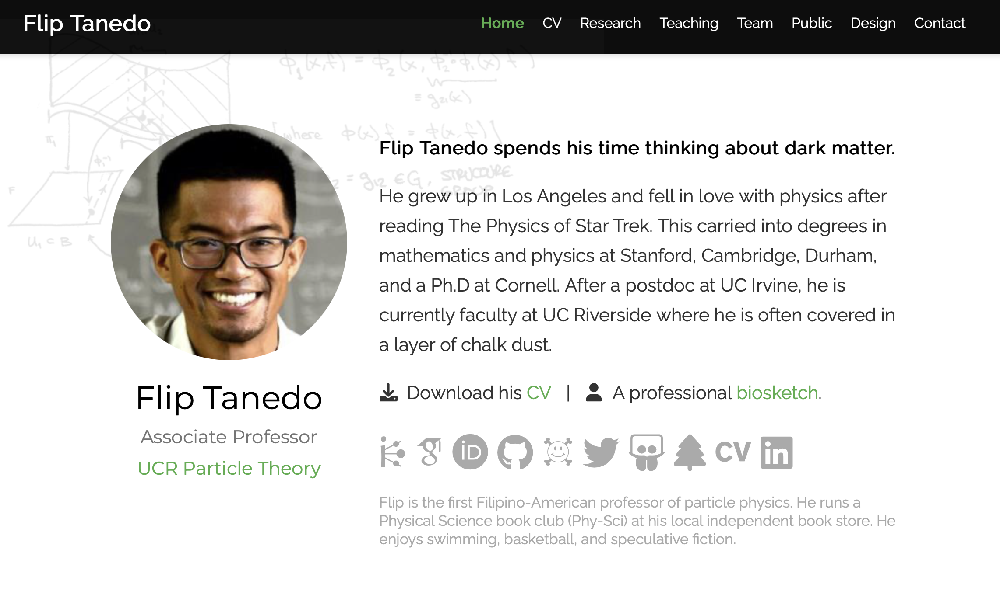
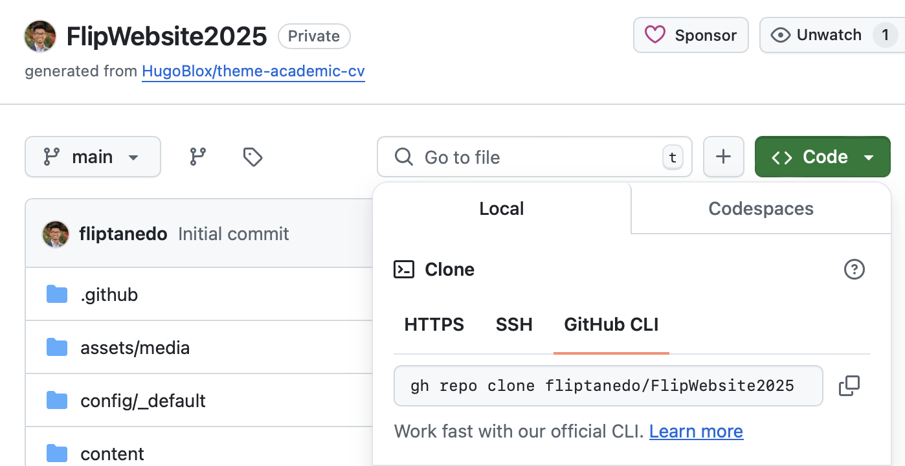
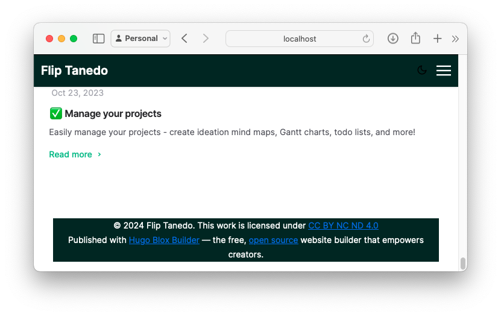
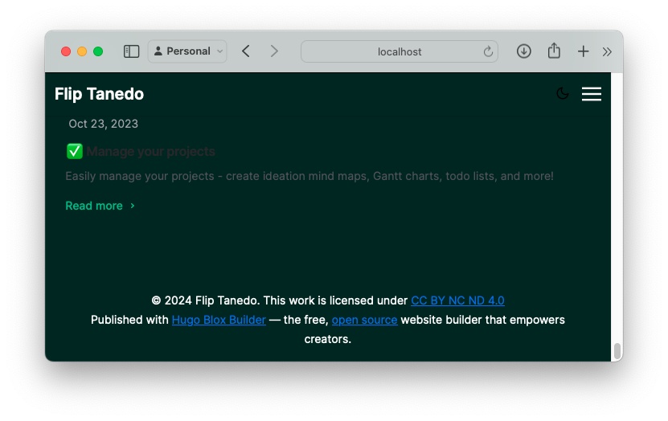
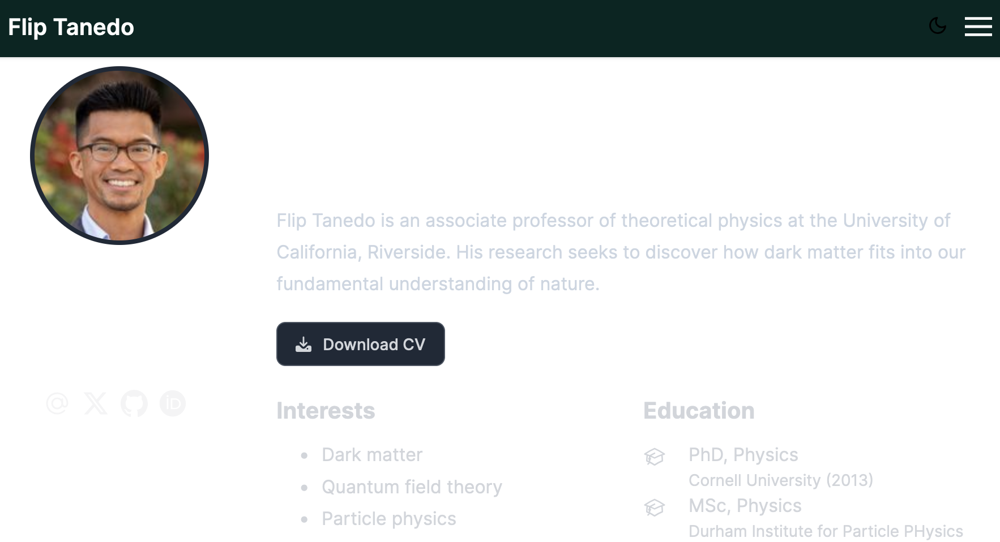
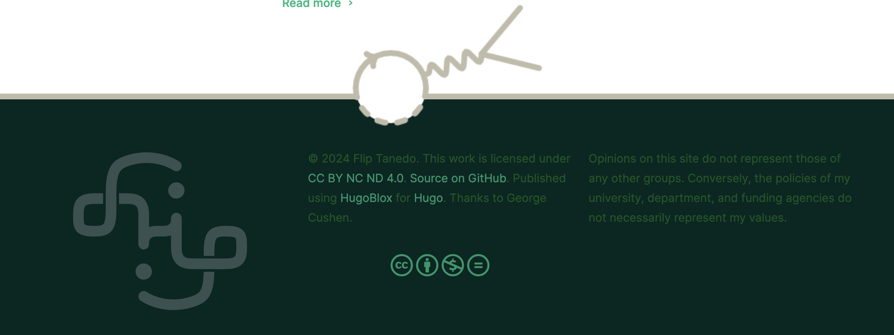
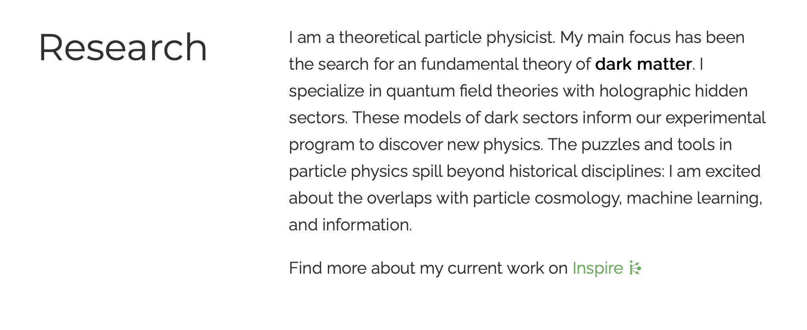
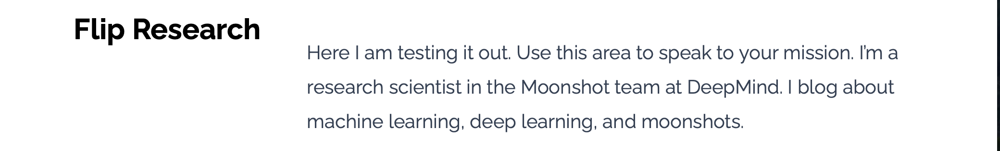
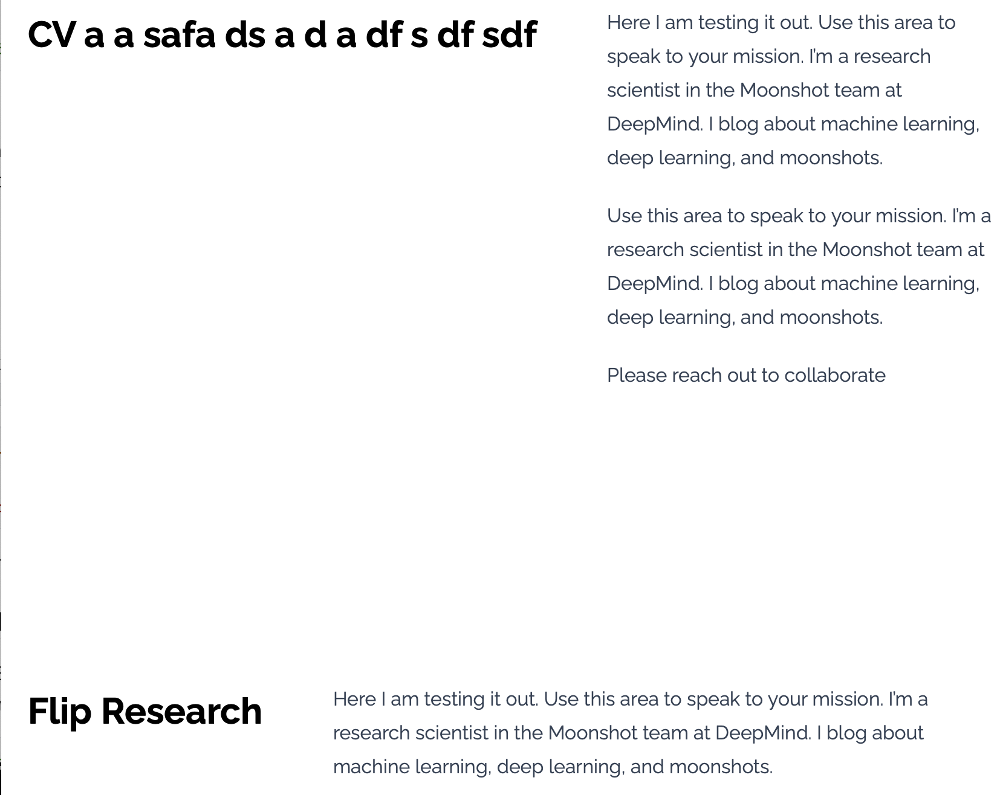

# Tanedo Group Website 2025

Hosted at  [particle.ucr.edu](https://particle.ucr.edu)
**Flip Tanedo**, flip.tanedo@ucr.edu
September 2024 
Based on [HugoBlox](https://hugoblox.com) 

I periodically re-do my personal website from scratch using the latest ~~Hugo Theme Academic~~ ~~Wowchemy~~ [HugoBlox](https://hugoblox.com) Academic CV template. Most of the material in this document copied from earlier websites. This `README.md` file is a personal reminder of how I edited the page; I revise it each time I  edit the page. 

**In support of HugoBlox**: George Cushen maintains HugoBlox. I am happy to be a lifetime supporter which comes with all current and future themes. Cushen is an active maintainer and I have found the HugoBlox Discord to be very helpful and responsive.

See [Hugo Notes](HugoNotes.md) for links and general Hugo(Blox) references.

Old versions: [2025](https://github.com/fliptanedo/FlipWebsite2025) (this) | [2024](https://github.com/fliptanedo/FlipWebsite2024) ([site](https://fliptanedo.github.io/FlipWebsite2024/))|  [2023](https://github.com/fliptanedo/FlipWebsite2023)| [2022](https://github.com/fliptanedo/FlipWebsite2022/blob/main/README.md) | [2021](https://github.com/fliptanedo/tanedo-website-2021/blob/master/README.md) | [2020](https://github.com/fliptanedo/flip-www-2020)

## Using Hugo Reminder

Make sure you have Hugo e.g. through Homebrew. If it's been a while, you may want to update (up**grade**) hugo using `brew upgrade hugo` at the terminal. 

`hugo server -D` 

The output will include a URL: `Web Server is available at http://localhost:1313/`, navigate your browser to this URL to view the page. [Link for convenience](http://localhost:1313/).

**Safari note**: there is a weird bug/feature in Safari's Developer Mode that affects cookies.  (As recently as Safari 17.4) Apparently when this mode is turned on to inspect website elements, one can be logged out of accounts (e.g. Google) and lose one's authentication token. After struggling with this bug, I've decided to use Chrome and Firefox for testing sites (e.g. looking up source).

## HugoBlox Notes

* The best place to get help and to see version updates is the [research.dev](https://discord.gg/6mmTvFUY) (HugoBlox) Discord server. The `#announcements` channel summarizes all the updates. 
* In 2024, HugoBlox moved from Bootstrap to Tailwind CSS as its CSS framework. This broke a *lot* of my workflow from previous years. This year I am rebuilding from scratch while learning Tailwind. 
* **Strategy**: I'm not going to touch Tailwind at all this round. I'll try to keep my CSS factored out so that in the future I can go over a CSS file and Tailwind-ify it. 

**Build information**

From `hugoblox.yaml`: `hugo_version: '0.126.3'`
From `go.mod`: `blox-tailwind v0.2.1-0.20240602133901-492e343c2a33`

## Quick comparison

Here's what the 2023 version looked like: (the 2024 page looks the same)



<mark>Insert screen shot of new version</mark>

## Initialize

Make sure you have installed Hugo. 

1. Go to [HugoBlox Academic CV Template](https://hugoblox.com/templates/details/academic-cv/) and click on **Edit**. This takes you to GitHub where you are invited to *create a new repository*. Go ahead and create this repository. 

   * Repository name: `FlipWebsite2025`
   * You can choose either public or private (you need to use **public** if you are deploying on GitHub pages)

2. Pull the code locally, e.g. `Code` > `GitHub CLI` 

   

   * Copy the `gh repo clone....` line
   * Runin a terminal at the parent director of the new website. For me, this is `/Documents/Website/` where further subdirectories correspond to different generations of the website. (*I know I'm "doing  version control wrong."*) This creates `/Documents/Website/FlipWebsite2025/` and populates it with the HugoBlox Academic CV template. 

3. **Move a copy of *this* file!** From the previous folder,`/Documents/Website/FlipWebsite2024/` , copy `README.md` and `figures/` to the new folder. The `figures/` folder contains images for this file and is unrelated to the website files. You may overwrite the template `README.md` from HugoBlox. 

4. Copy over `.gitignore` from the previous version. This file is not visible by default in the macOS Finder app. Use the terminal. From `/FlipWebsite2024`, run

   ```
   cp .gitignore ../FlipWebsite2025/
   ```

5. If you want to deploy to GitHub Pages as a staging ground, you can follow these instructions: https://docs.hugoblox.com/reference/deployment/ (I'm doing this so I can compare this new page to my previously published page.)

6. Start hacking the template by copying over bits from the old site. The steps for this are summarized below. As you go through this, update the `README.md` file accordingly. You future self will thank you (take this moment to thank me).

# From Scratch Set Up

This is a possibly temporary section as I navigate the Tailwind-based template for the first time. All file structure is relative to `FlipWebsite2025/`

1. [Edit the Biography](https://docs.hugoblox.com/tutorial/resume/step-2/). Go to `./content/authors/admin/_index.md`
   * Update everything. Comment out what you don't need.
   * Upload a new profile photo as  `./content/authors/admin/avatar.jpg`. I don't like how much the default scales down the photo quality. <mark>This is something to fix later.</mark>
2. Update site information. Go to `./config/_default/`
   * `hugo.yaml`: Update website name and URL
   * `menus.yaml`: comment out everything except bio for now
   * `params.yaml`: 
     * `mode: light`: I don't want to make two versions of all of my design elements yet
     * `navbar`: turn off search and theme chooser, name as logo text
     * Enable math
     * At the bottom of the page, add the following:
       ```yaml
       ## ADDED BY FLIP
       
       # Feynman Diagram Footer
       footmark: 'layout/feynmanfooter.png'
       
       # Footer logos
       midlogo: 'logo/UCRPAlogo2.png'
       mylogo: 'logo/FlipAmbigram.png'
       ## /FLIP
       ```
     
   
3. Transfer images. Copy over `./assets/media` including `icon.png`, a 512x512 favicon.
4. Transfer the `./static` folder. This one has lots of potentially large files. It is a good time to do housekeeping to remove anything that is no longer being used.  It looks like there's a new suggested folder called `./static/uploads` where one is meant to place files like a CV. Instead, I have my own `./static/files/` subdirectory.

## Download Template Files

Prepare a `/layouts_templates` folder. This is a place to store a copy of the HugoBlox template layouts. We use these to make customized templates that we transfer into the `/layouts` folder. 

* **Background**: Refer to the [Hugo Blox: Extend Hugo Blox documentation](https://docs.hugoblox.com/reference/extend/#override-a-component); you need to match the template to the module version; this is trivial if you're doing a fresh install. (From GitHub: Code > Download ZIP)
* You'll need to download a local copy of [HugoBlox/hugo-blox-builder](https://github.com/HugoBlox/hugo-blox-builder) and 
  * copy the `/modules/blox-tailwind/layouts/` to a new `./layouts_templates/` folder. 
  * copy the  `/modules/blox-tailwind/assets/` to a new `./assets_templates/` folder. 

* We will copy files from these template folders into the non-template (mostly empty for now) folders to overrwrite components as needed. 
* Add a line in `.gitignore` with `layouts_templates/` and `assets_templates/` so that we we don't re-upload these reference files to GitHub. (You shouldn't need to do this if the previous `.gitignore` already included this and you copied it over.)

A useful guideline: when I make edits to a template file, clearly demarcate those edits with generous comment tags. This help if I need to find these changes later.

### How I edit files

In what follows, I copy the default templates from the `...templates/`  In order to help us mark our edits for next time, we use tags as follows:

```html
<!-- FLIP DEL -->
old source
<!-- /FLIP -->
<!-- FLIP ADD -->
new source
<!-- /FLIP -->
```

This makes it much easier to see what I did next time I edit or remake my site. This is especially helpful when the HugoBlox templates change. My routine is to edit the latest template each time rather than trying to patch up old code. (Bonus: I learn more this way.)

Not *all* of the edits has these blocks. Some of them are harder to comment out because of of Hugo insertions that I don't want to mess with. 

### Notes how CSS files are processed

Take a look at `./assets_templates/css/` to see how HugoBlox organizes its CSS files. `styles.css` imports the `all.css` files in each directory, which each in turn call the other CSS files in their directories. 

### custom CSS

Following the documentation on adding [custom CSS](https://docs.hugoblox.com/reference/extend/#customize-style-css):

1. Create the `assets/css/` folder if it doesn’t exist
2. Create a file named `custom.css` in the `assets/css/` folder
3. Add your custom CSS code to the file you created and re-run Hugo to view changes

So let's go ahead and do that. Create `./assets/css/custom.css`.  We can transfer over the previous version if this isn't my first time doing this. Note that you do have to re-run Hugo to see any style sheet changes.

The lion's share of my `custom.css` edits are for the custom Feynman Diagram footer bar. 

# Basic Blox

Go to `./content/_index.md` and update the section details. This is where you can update the links to a pdf CV and to the background for the biography block (`resume-biography-3`).

## Navbar

### Background

The navigation bar template is `./layouts/partials/components/headers/navbar.html`. (Create this if needed, copying from `./layouts_templates`.)

The CSS that describes the navigation bar is in `./assets/css/blox/navbar.css`. Copy this from `./assets_templates/` and edit the file. I didn't end up editing this for this round.

### What I did

I renamed the navbar template to `./layouts/partials/components/headers/navbarflip.html` and updated `./config/_default/params.yaml` to have: 

```
# Site header
header:
  navbar:
    enable: true
    blox: "navbarflip"
```

`navbarflip.html` has two primary edits at the top:

```html
<!-- FLIP DEL -->
<!-- <header id="site-header" class="header"> -->
<!-- /FLIP -->
<!-- FLIP ADD -->
<header id="site-header" class="header" style="background-color: #012622; color: white">
<!-- /FLIP -->

  <nav class="navbar px-3 flex justify-left">
    <div class="order-0 h-100">
      <!-- Brand -->
<!-- FLIP DEL -->
      <!-- <a class="navbar-brand" href="{{ site.Home.RelPermalink }}" title="{{ site.Title }}"> -->
<!-- /FLIP -->
<!-- FLIP ADD -->
      <a class="navbar-brand" href="{{ site.Home.RelPermalink }}" title="{{ site.Title }}" style="color: white">
<!-- /FLIP -->
```

I've changed the color of the navbar to ~~black~~ very dark green (#012622) and the text (and links) to white.

### In the future

* This looks surprisingly okay.


## Footer

The other big edit of mine is the "Feynman Diagram footer." This one requres a bit more digging. 

### Background

`./layouts_templatse/partials/site_footer.html ` contains the `<footer>` tag. Want to see how this works? Make a copy to the main `layouts/` folder,`./layouts/partials/site_footer.html ` , and let's play with it. Suppose we add the same color style in the `<footer>` tag as we did for the `navbar` tag above:

```html
<footer class="container mx-auto flex flex-col justify-items-center text-sm leading-6 mt-24 mb-4 text-slate-700 dark:text-slate-200" style="background-color: #012622; color: white">
```

We see that the footer does not span the entire window.



Okay! So it's not going to be easy. Referring back to the 2024 notes, we can see how we built up this framework. I think we can follow the same basic edits as before. 

### Make a new resume-biography block

We will want to modify the resume block (the first block with the profile photo) later. Because the resume block is a source of headaches when fixing the footer (see below), we should go ahead and make the new resume-biography block now. Make a copy of `./layouts_templates/partials/blox/resume-biography-3.html` and name it `./layouts/partials/blox/resume-biography-flip.html` . 

Go to `./content/_index.md` (do not confuse this with `./content/authors/_index.md`) and update the first block:

```md
sections:
  - block: resume-biography-flip
    content:	
```

This is important for the footer bar because we're going to 'paint' a few layers with background colors. The HugoBlox biography block adds a nice custom background for this block, but that background ends up being painted over by the solid colors. Fortunately, HugoBlox automatically creates `<section>` tags with ID equal to the block name. This means that in our CSS we can give the  ID `resume-biography-flip` (or whatever new name we use) a large z-value so that the background is visible over our re-painting. 

### Repainting? What?

I'd like the footer to be a solid color (same as the navbar) with some decorations on top. However, this turns out to be tricky. See the **Background** section above. In order to let the footer be a solid color, we need to make the entire page a solid color. But once we do that, we need to make the sections between the navbar and the footer white. 

In the past (pre-Fall 2024) I created a `<div id="THECONTENT">` that encapsulated everything between the navbar and the footer. In the CSS, I gave this ID a white background. With the new Tailwind system, this ended up leaving some ackward areas in the footer that were not properly colored (see Background above). 

It turns out that a more direct way of doing this is to color the `body` tag with the navbar color and then color the `PAGEBODY` ID (added below in `baseof.html`) white.  This makes you *think* you can just get rid of the `THECONTENT` ID. Wrong! For reasons that are not obvious to me, if you delete this div the page has a white bar on the bottom. What's really odd: you can color this ID or not even mention coloring this ID (empty CSS), and you fix the white bar problem. (Coloring this ID a different color will replace the erroneous white bar with the different color.) So you have to leave `THECONTENT` . Weird, but it works. 

Here's what it looks like if we set `THECONTENT` to have a pink background:


As a bonus for all of this, we are able to fix the annoying 'overscroll' issues where pulling the site past its formal boundary (something you can do in iOS and Firefox) does not pull up a white area, but rather a colored area to make it seem like the navbar or footer extends past the screen. 

Get it?

### baseof.html

Background: what is [baseof](https://gohugo.io/templates/base/#readout)

Copy over `./layouts/_default/baseof.html` from `./layouts_templates`. It looks like this changed a bit from the Bootstrap version. I went ahead an added white space to make things easier to read. (Double check that this doesn't break anything by checking `hugo server -D`. )

1. Vanity: add a comment at the top of the page to note that I've edited the Hugo Blox template. Insert into Line 3.

   ```html
   <!doctype html>
   {{ "<!-- This site was created with Hugo Blox. https://hugoblox.com -->" | safeHTML }}
   {{ "<!-- Flip Tanedo has edited the Academic CV template. -->" | safeHTML }}
   {{ printf "<!-- Last Published: %s -->" (now | time.Format ":date_long") | safeHTML }}
   ```

2. Below the `<div class="page-header ...>` div and the `<div class="page body...>` div we open a new div: `<div id="THECONTENT">`. This is around line 31. 

   ```html
     <!-- FLIP ADD: opened a new div id="THECONTENT" for framing -->
     <div id="THECONTENT">
     <!-- Closed below; see ./assets/scss/custom.css -->
     <!-- /FLIP -->
       
     <div class="page-body {{if ne .Type "landing"}} my-10{{end}}">
   ```

   See how I displayed the `<div class="page-body...>` line just to help you orient yourself? You're welcome. You may want to pad things with more white space. 

   Let's go ahead close that new div. Let's place the closing `</div>` near the bottom, just above the `{{/* EXTENSIBILITY HOOK: BODY-END */}}`. 

   ```html
       <!-- FLIP ADD -->
       </div> <!-- closes id="THECONTENT" -->
       <!-- /FLIP -->
   
   
       {{/* EXTENSIBILITY HOOK: BODY-END */}}
       {{ partial "functions/get_hook" (dict "hook" "body-end" "context" .) }}
   
   
     </body>
   ```

   Now we have a container div for the entire visible area. Go ahead, if you color this div, it will color the entire area, including the region around the footer. 

   e.g. if we do this: ` <div id="THECONTENT" style="background-color: #012622; color: white">` then we get:
   
   Compare this to the image under **Background** in this section, above. Ok, now remove that styling because we're not coloring the entire site dark green.

3. Revise the `<div class="page body...">` tag around line 38 by giving it an `id` .

   ```html
   <!-- FLIP DEL -->
   <!-- <div class="page-body {{if ne .Type "landing"}} my-10{{end}}"> -->
   <!-- /FLIP -->
   <!-- FLIP ADD -->
   <div class="page-body {{if ne .Type "landing"}} my-10{{end}}" id="PAGEBODY">
   <!-- /FLIP -->
       {{ block "main" . }}{{ end }}
   </div>
   ```

   This will let us style the div that includes all of the blocks. Observe that this div surrounds the `{{ block "main" . }}{{ end }}`  Hugo call where all of the sections are inserted.

4. Now just above where we close the `THECCONTENT` div is a div called `page-footer`. Here's what it looks like initially:
   ```html
       <div class="page-footer">
         {{ partial "site_footer" . }}
       </div>
   ```

   And now you insert several more divs above the `{{ partial "site_footer" . }}`. 
   ```html
       <div class="page-footer">
         <!-- FLIP ADD -->
           <div style="position: relative; width: 0; height: 0">
             <div id="feynmanfoot" style="background-image:url('{{ $.Site.BaseURL }}/img/{{ .Site.Params.footmark }}');"></div>
           </div>
           <!--  -->
           <div id="botbar1"></div>
           <!--  -->
           <div id="FOOTERBAR"> <!-- closed after the site_footer code -->
           <!--  -->
         <!-- /FLIP -->
         <!-- ORIGINAL -->
             {{ partial "site_footer" . }}
         <!-- /ORIGINAL -->
         <!-- FLIP ADD -->
           </div> <!--  closes div FOOTERBAR-->
         <!-- /FLIP -->
       </div>
   ```

   * A div that is positioned relatively. It contains a nested div, `feynmanfoot` that contains the Feynman diagram.  <mark>I haven't saved the image nor have I updated the params file.</mark>
   * A `FOOTERBAR` div that surrounds the `site_footer` code.

If you copied over `./assets/css/custom.css`  then things should be looking pretty good right now. If you're confused about what some of the footer elements do, I suggest recoloring them temporarily to see where they show up.

### A total kludge

The layers of containers and backgrounds above are arranged to fix the "overscroll" color (keep the true background dark, but leave an area `#PAGEBODY` that is white). However, a side effect using a `id="PAGEBODY"` to set the background to be white means that the background of the biography widget is hidden. I thought this was being overwritten by the CSS. It turns out that the background was just buried. By fixing the z-index to be large, the background comes back. 

Here's what I noticed in the page source:

```html

<section id="section-resume-biography-flip" class="relative hbb-section blox-resume-biography-flip  dark" style="padding: 6rem 0 6rem 0;" >
 <div class="home-section-bg  bg-image" style="background-color: black;background-image: url(&#39;http://localhost:59799/media/ChalkboardBG_hu14443614070061421386.webp&#39;);background-size: cover;background-position: center;filter: brightness(1);">
   
 </div>	
```

I couldn't figure out where this is generated. It is part of the `{{block "main" .}}{{end}}` automatically generated HTML. You can see that the background image is generated and that there's an id for the section. So the kludge is to add in our CSS some styling to put this section at nonzero z index. 

```css
#section-resume-biography-flip
{
	/* This is a total kludge */
	/*	*/
	z-index: 1;
}
```

I'm surprised that this worked. It also let me avoid having to figure out where the shortcode is that generated the section tag. 

**Note**: Originally I put in a *large* z-index, 250. This led to a problem where the biography blog would scroll OVER the navbar. It turns out that z=1 is sufficient for our needs. 


Here's what happens if we did not add the z-index on `#section-resume-biography-flip`:



The beautiful background has disappered under the other background colors.

* Some hints about the section stuff: (I can't figure it out)
  * https://discourse.gohugo.io/t/creating-a-generic-section-template/954/2
  * https://cloudcannon.com/blog/the-ultimate-guide-to-hugo-sections/

## Fixing up the rest of the footer

The footer should look like this:


Let's work on that region below the Feynman diagram. The default footer style is stored as

`./layouts/partials/components/footers/minimal.html`.

Go ahead and copy this from `./layouts_templates/` and paste it into `./layouts./...` , renaming it to `./layouts/partials/components/footers/flipfoot`. 

Go to `./config/_default/params.yaml` and use `flipfoot` as the block:

```yaml
# Site footer
footer:
  blox: "flipfoot"
    notice: '© {year} Me. This work is licensed under {license}'
    license:
      enable: true
      allow_derivatives: false
      share_alike: true
      allow_commercial: false
```

Note that previously in the Bootstrap version of HugoBlox this line was `  block: flipfoot`. 

Now we edit `./layouts/partials/components/footers/flipfoot.html`. Unfortunately my edits from 2024 do not carry over since that used the Bootstrap grid. Fortunately, it is not too hard to create the analogous grid in Tailwind. For three columns, the structure is:

```html
<div class='grid sm:grid-cols-3'>
	<div>1</div>
	<div>2</div>
	<div>3</div>
</div>
```

The `sm:grid-cols-3` tells tailwind that the next three [sub-]divs should appear in consecutive columns if the screen size is *at least* `sm`. 

We can now copy over the site-footer divs from last year. There are some tweaks we'll need.

### Font Awesome Fix (temp?)

Also an experiment with the [hook system](https://docs.hugoblox.com/reference/extend/). Create the following file: `.layouts/partials/hooks/head-end/font-awesome-flip.html`

Font Awesome installation (this was mine, you should get your own):

```html
<script src="https://kit.fontawesome.com/ae82ca92c2.js" crossorigin="anonymous"></script>`
```

This seems to have fixed a problem where the Creative Commons Font Awesome logos were not showing up. (I assume this problem will be fixed separately)

## Site License 

Tweak `./layouts/partialss/site_footer_license.html` at this point:

```html
<!-- FLIP DEL -->
  <!-- <p class="powered-by footer-license-icons"> -->
<!-- /FLIP -->
<!-- FLIP ADD --> <!-- add centering -->
  <p class="powered-by footer-license-icons text-center">
<!-- /FLIP -->
```

This is to center the Creative Commons icons. 

### CSS tweaks for the footer

These are some items I've added to `./assets/css/custom.css` for the footer: 

```css
.powered-by{
  color: #065522;
  text-decoration: none;
}

.powered-by a:link{
  color: #079669;
  text-decoration: none;
}
```

### How it should look



And it should look reasonable on a small screen. 

## Creating a template block

The older Bootstrap HugoBlox template had these great two column responsive template (markdown) blocks



As of this writing the Tailwind version does not yet have such a template. However, it looks like it should be relatively straightforward to adapt such a block from the original `markdown` block in the Bootstrap version

### Notes on the existing Markdown Block

From `./layouts_tempaltes/partials/blox/markdown.html`

```html
<div class="flex flex-col items-center max-w-prose mx-auto gap-3 justify-center px-6">

  <div class="mb-6 text-3xl font-bold text-gray-900 dark:text-white">
    {{ $title }}
  </div>

  {{ with $text }}
  <div class="prose prose-slate lg:prose-xl dark:prose-invert max-w-prose">{{ . }}
  </div>
  {{ end }}
  
</div>
```

This does not give the two column split that I'm looking for. Let us draw inspiration from the Bootstrap version of HugoBlox. Here, the two column markdown layout matched the break poitns of the about widget. That is: at some common break point, all home page elements became one column. To be efficient, we can just follow the structure of the `resume-biography` block. 

(How I played with this: make a test copy of `resume-biography-flip` and star hacking away to see if we can break it down into two columns.)

The result is:

```html


<div class="resume-biography px-3 flex flex-col md:flex-row justify-center gap-12">
  <div class="flex-none m-w-[130px] mx-auto md:mx-0">

    <div id="profile" class="flex justify-center items-center flex-col">
      <div class="portrait-title dark:text-white">
        <div class="text-3xl font-bold mb-2 mt-6">
          {{ $title }}
        </div>
      </div>
    </div>

  </div>


  <div class="flex-auto max-w-prose md:mt-12">
    
    {{ with $text }}<div class="prose prose-slate lg:prose-xl dark:prose-invert max-w-prose">{{ . }}</div>{{ end }}

  </div>

</div>
```

I call this `./layouts/partials/blox/flip_markdown.html`. 

A small edit: I did not like that there is a `<div id="profiles">` in a non-profile block. If I simply removeo this, the text is misaligned: 

Peeking at `./assets_templates/css/blox/biography.css` shows that `.resume-bigroaphy #profile` has additional padding. So let's put this in:

``` html
<!-- <div id="profile" class="flex justify-center items-center flex-col"> -->
    <div class="flex justify-center items-center flex-col" style="padding: 30px 10p;position: relative;"> 
```

Hmm. That did not seem to work. Also, it seems like the left side bar is not actually fixed length.



## Font

The Bootstrap version of HugoBlox handled fonts with a separate TOML file. At the time of this writing, the present Tailwind version does not yet have such an interface. The key html is as follows:

````html
  <style>
    @font-face {
      font-family: 'Inter var';
      font-style: normal;
      font-weight: 100 900;
      font-display: swap;
      src: url(/dist/font/Inter.var.woff2) format(woff2);
    }
  </style>
````

You can find this in `layouts_templates/partials/site_head.html`:

```go
 {{/* Load font theme */}}
  {{ $font_family := "Inter var" }}
  {{ $font_file := "" }}
  {{ $font_type := "" }}
  {{ if eq site.Params.appearance.font "serif" }}
    {{ $font_file = "RobotoSlab-VariableFont_wght.ttf" }}
    {{ $font_type = "truetype" }}
  {{else}}
    {{ $font_file = "Inter.var.woff2" }}
    {{ $font_type = "woff2" }}
  {{end}}
  {{ $font := resources.Get (printf "dist/font/%s" $font_file) }}
  <style>
    @font-face {
      font-family: '{{$font_family}}';
      font-style: normal;
      font-weight: 100 900;
      font-display: swap;
      src: url({{ $font.RelPermalink }}) format({{$font_type}});
    }
  </style>
```

I think it is not too had to have the Hugo variables (e.g. `$font_family`) pull from the `.config/_default/params.yaml` file. However, I expect this to be updated in a future HugoBlox version so there's no need to reinvent the wheel. For now, let me make my own copy  `./layouts/partials/site_head.html` where the font is loaded by hand.

Let's use [Raleway](https://fonts.google.com/specimen/Raleway), a variable width font available on Google Fonts. Grab the embed code. Google gives the following for `<head>`:

```html
<link rel="preconnect" href="https://fonts.googleapis.com">
<link rel="preconnect" href="https://fonts.gstatic.com" crossorigin>
<link href="https://fonts.googleapis.com/css2?family=Raleway:ital,wght@0,100..900;1,100..900&display=swap" rel="stylesheet">
```

And for CSS:

```css
// <uniquifier>: Use a unique and descriptive class name
// <weight>: Use a value from 100 to 900

.raleway-<uniquifier> {
  font-family: "Raleway", sans-serif;
  font-optical-sizing: auto;
  font-weight: <weight>;
  font-style: normal;
}		
```

Here's how we use that information. Let's go to `./layouts/partials/site_head`:

```html
  <!-- FLIP DEL -->
  <!-- 
  <style>
    @font-face {
      font-family: '{{$font_family}}';
      font-style: normal;
      font-weight: 100 900;
      font-display: swap;
      src: url({{ $font.RelPermalink }}) format({{$font_type}});
    }
  </style>
  -->
  <!-- /FLIP -->
  <!-- FLIP ADD -->
  <style>
  @import url('https://fonts.googleapis.com/css2?family=Raleway:ital,wght@0,100..900;1,100..900&display=swap');
  </style>
  <!-- /FLIP  -->
```

We're putting the `@import` call in here. Now go to `./assets/css/custom.css` and paste the following on top:

```css
   /*
  ////////////////////
 //  FONT UPDATE   //
////////////////////
*/

body {
  font-family: "Raleway", sans-serif;
  font-optical-sizing: auto;
  font-weight: 100 900;
  font-style: normal;
}
```

With this, the font should be updated. 


## CV Widget

I'm using the revised `flip_markdown` block as a template to make a CV block. The edits will parallel the `flip.cv.html` block from the earlier 2024 Bootstrap version of my site. 

## Notes

* Colors
  * Dark green for header: `background-color: #012622`; I may want to go with a dark moss green rather than a dark pine green.
  * I may want to make a more transparent version of my amibgram for the footer
* Do I want the profile picture to be larger and higher res? The default template processes the profile image through a Hugo algorithm to shrink the file size. However, these profile pictures are significant when department pull photos for seminar flyers. 

### Old Notes

* Responsive design: the phone view looks weird for default blox: no margin. 
  * Geo fixed this here: https://github.com/HugoBlox/hugo-blox-builder/commit/4f621dfa3a5ab798bea17ad2760bd61815c76f25
