# Tanedo Group Website 2025

Hosted at  [particle.ucr.edu](https://particle.ucr.edu)
**Flip Tanedo**, flip.tanedo@ucr.edu
September 2024 
Based on [HugoBlox](https://hugoblox.com) 

I periodically re-do my personal website from scratch using the latest ~~Hugo Theme Academic~~ ~~Wowchemy~~ [HugoBlox](https://hugoblox.com) Academic CV template. Most of the material in this document copied from earlier websites. This `README.md` file is a personal reminder of how I edited the page; I revise it each time I  edit the page. 

**Supporting HugoBlox**: George Cushen maintains HugoBlox. I am happy to be a lifetime supporter which comes with all current and future themes. Cushen is an active maintainer and I have found the HugoBlox Discord to be very helpful and responsive.

See [Hugo Notes](HugoNotes.md) for links and general Hugo(Blox) references.

Old versions: [2025](https://github.com/fliptanedo/FlipWebsite2025) (this) | [2024](https://github.com/fliptanedo/FlipWebsite2024) ([site](https://fliptanedo.github.io/FlipWebsite2024/)) |  [2023](https://github.com/fliptanedo/FlipWebsite2023) | [2022](https://github.com/fliptanedo/FlipWebsite2022/blob/main/README.md) | [2021](https://github.com/fliptanedo/tanedo-website-2021/blob/master/README.md) | [2020](https://github.com/fliptanedo/flip-www-2020) [unfortunately I did not have the foresight to host 2023 and before on GitHub Pages as an archive; copies are stored on my UCR webspace. ]


## Table of contents

[TOC]

## Using Hugo Reminder

Make sure you have Hugo e.g. through Homebrew. If it's been a while, you may want to update (up**grade**) hugo using `brew upgrade hugo` at the terminal. 

`hugo server -D` 

The output will include a URL: `Web Server is available at http://localhost:1313/`, navigate your browser to this URL to view the page. [Link for convenience](http://localhost:1313/).

The homepage contents are in: `./content./_index.md` 

25 Dec 2024: I've upgraded Hugo and I get the following error:

```
ERROR deprecated: site config key paginate was deprecated in Hugo v0.128.0 and will be removed in Hugo 0.141.0. Use pagination.pagerSize instead.
```

This doesn't break anything. It looks like I'm calling Hugo 0.126.

**Safari note**: there is a weird bug/feature in Safari's Developer Mode that affects cookies.  (As recently as Safari 17.4) Apparently when this mode is turned on to inspect website elements, one can be logged out of accounts (e.g. Google) and lose one's authentication token. After struggling with this bug, I've decided to use Chrome and Firefox for testing sites (e.g. looking up source).

## HugoBlox Notes

* The best place to get help and to see version updates is the [research.dev](https://discord.gg/6mmTvFUY) (HugoBlox) Discord server. The `#announcements` channel summarizes all the updates. 

### Tailwind

* **Update:** it became unbearable to *not* use the gamut of Tailwind functions. 

  * See [Hugo Blox reference on extending with Tailwind](https://docs.hugoblox.com/reference/extend/)

  * The trick is that you have to run the following junk:
    ```shell
    npm install -g pnpm && hugo && hugo mod vendor && cd ./_vendor/github.com/HugoBlox/hugo-blox-builder/modules/blox-tailwind/ && pnpm i && export HB_TW_CONTENT='../../../../../../hugo_stats.json' && npx tailwindcss -i ./assets/css/styles.css --config ./tailwind.config.js -o ../../../../../../assets/dist/wc.min.css --minify --postcss && cd ../../../../../../ && rm -rf _vendor
    ```

  * I'm going to [make a zsh script](https://www.geeksforgeeks.org/creating-and-running-bash-and-zsh-scripts/) for this. I'll call it `flip_hugo_tailwind.zsh` and palce it in the website root directory. 

    * Don't forget the permissions: ` chmod +x flip_hugo_tailwind.zsh`
    * Run with: `./flip_hugo_tailwind.zsh  `
    * So now every time I need to use some Tailwind code, I can run `./flip_hugo_tailwind.zsh  ` (I've checked that this works)
    * I do *not* think you have to install `nvm` or `node` separately. 

* In 2024, HugoBlox moved from Bootstrap to Tailwind CSS as its CSS framework. This broke a *lot* of my workflow from previous years. This year I am rebuilding from scratch while learning Tailwind. 

* ~~**Strategy**: I'm not going to touch Tailwind at all this round. I'll try to keep my CSS factored out so that in the future I can go over a CSS file and Tailwind-ify it.~~

* The way Tailwind works is that it offers a *large* library of styles. In order to save on loading times, you have to run a script which parses your code so that *only* the styles that your site uses are saved to a compact (minified) css style file. Since I do not want to run Tailwind for this set of iterations, I am limited to the Tailwind classes that are already in the defautl Hugo Blox template. For example, we have access to class `w-64` and `w-12` for widths, but not any other width in between. 

* ~~Open question for next time: how does it work when I run Tailwind on my own local site? Will it produce a separate CSS file that I attach to `custom.css`?~~

### Record Keeping

**Build information**

From `hugoblox.yaml`: `hugo_version: '0.126.3'`
From `go.mod`: `blox-tailwind v0.2.1-0.20240602133901-492e343c2a33`

Image sources are in my **graphics folder**, which I do not upload to Github.

## Quick comparison

Here's what the 2023 version looked like: (the 2024 page looks the same)

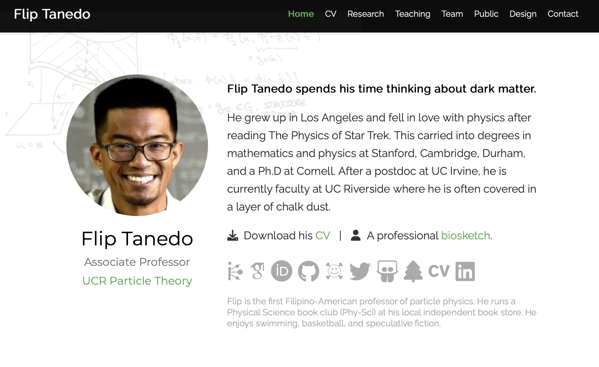

Here's the revision: 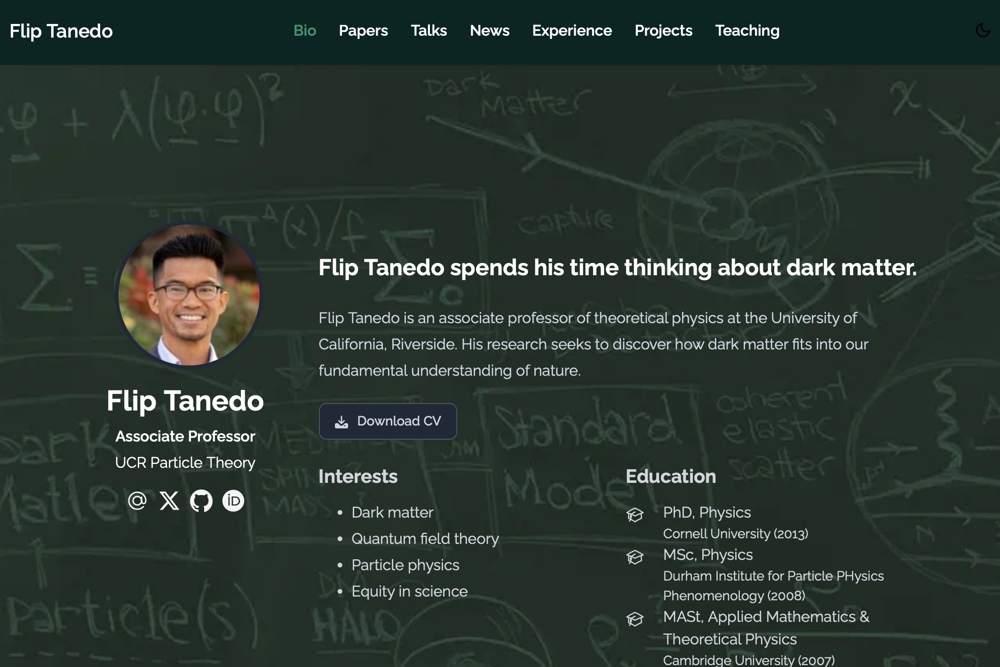

## Initialize

Make sure you have installed Hugo. 

1. Go to [HugoBlox Academic CV Template](https://hugoblox.com/templates/details/academic-cv/) and click on **Edit**. This takes you to GitHub where you are invited to *create a new repository*. Go ahead and create this repository. 

   * Repository name: `FlipWebsite2025`
   * You can choose either public or private (you need to use **public** if you are deploying on GitHub pages)

2. Pull the code locally, e.g. `Code` > `GitHub CLI` 

   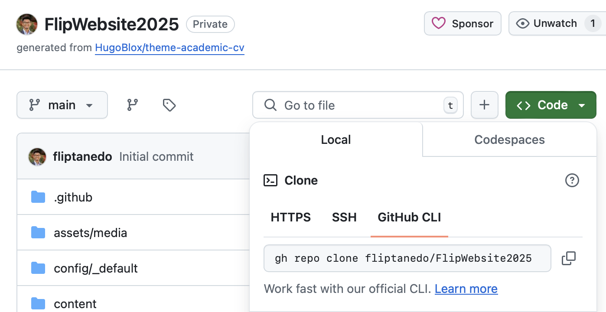

   * Copy the `gh repo clone....` line
   * Runin a terminal at the parent director of the new website. For me, this is `/Documents/Website/` where further subdirectories correspond to different generations of the website. (*I know I'm "doing  version control wrong."*) This creates `/Documents/Website/FlipWebsite2025/` and populates it with the HugoBlox Academic CV template. 

3. **Move a copy of *this* file!** From the previous folder,`/Documents/Website/FlipWebsite2024/` , copy `README.md` and `figures/` to the new folder. The `figures/` folder contains images for this file and is unrelated to the website files. You may overwrite the template `README.md` from HugoBlox. 

4. Copy over `.gitignore` from the previous version. This file is not visible by default in the macOS Finder app. Use the terminal. From `/FlipWebsite2024`, run

   ```
   cp .gitignore ../FlipWebsite2025/
   ```

5. If you want to deploy to GitHub Pages as a staging ground, you can follow these instructions: https://docs.hugoblox.com/reference/deployment/ This is a nice way to compare the new site to my previously published site. It also serves to archive old versions of the page.

6. Start hacking the template by copying over bits from the old site. The steps for this are summarized below. As you go through this, update the `README.md` file accordingly. You future self will thank you (take this moment to thank me).

# From Scratch Set Up

This is a possibly temporary section as I navigate the Tailwind-based template for the first time. All file structure is relative to `FlipWebsite2025/`

1. [Edit the Biography](https://docs.hugoblox.com/tutorial/resume/step-2/). Go to `./content/authors/admin/_index.md`
   * Update everything. Comment out what you don't need.
   * Upload a new profile photo as  `./content/authors/admin/avatar.jpg`. I don't like how much the default scales down the photo quality. <mark>This is something to fix later.</mark>
2. Update site information. Go to `./config/_default/`
   * `hugo.yaml`: Update website name and URL
   * `menus.yaml`: comment out everything except bio for now
   * `params.yaml`: 
     * `mode: light`: I don't want to make two versions of all of my design elements yet
     * `navbar`: turn off search and theme chooser, name as logo text
     * Enable math
     * At the bottom of the page, add the following:
       ```yaml
       ## ADDED BY FLIP
       
       # Feynman Diagram Footer
       footmark: 'layout/feynmanfooter.png'
       
       # Footer logos
       midlogo: 'logo/UCRPAlogo2.png'
       mylogo: 'logo/FlipAmbigram.png'
       ## /FLIP
       ```
     
   
3. Transfer images. Copy over `./assets/media` including `icon.png`, a 512x512 favicon.
4. Transfer the `./static` folder. This one has lots of potentially large files. It is a good time to do housekeeping to remove anything that is no longer being used.  It looks like there's a new suggested folder called `./static/uploads` where one is meant to place files like a CV. Instead, I have my own `./static/files/` subdirectory.

## Download Template Files

Prepare a `/layouts_templates` folder. This is a place to store a copy of the HugoBlox template layouts. We use these to make customized templates that we transfer into the `/layouts` folder. 

* **Background**: Refer to the [Hugo Blox: Extend Hugo Blox documentation](https://docs.hugoblox.com/reference/extend/#override-a-component); you need to match the template to the module version; this is trivial if you're doing a fresh install. (From GitHub: Code > Download ZIP)
* You'll need to download a local copy of [HugoBlox/hugo-blox-builder](https://github.com/HugoBlox/hugo-blox-builder) and 
  * copy the `/modules/blox-tailwind/layouts/` to a new `./layouts_templates/` folder. 
  * copy the  `/modules/blox-tailwind/assets/` to a new `./assets_templates/` folder. 

* We will copy files from these template folders into the non-template (mostly empty for now) folders to overrwrite components as needed. 
* Add a line in `.gitignore` with `layouts_templates/` and `assets_templates/` so that we we don't re-upload these reference files to GitHub. (You shouldn't need to do this if the previous `.gitignore` already included this and you copied it over.)

A useful guideline: when I make edits to a template file, clearly demarcate those edits with generous comment tags. This help if I need to find these changes later.

### How I edit files

In what follows, I copy the default templates from the `...templates/`  In order to help us mark our edits for next time, we use tags as follows:

```html
<!-- FLIP DEL -->
old source
<!-- /FLIP -->
<!-- FLIP ADD -->
new source
<!-- /FLIP -->
```

This makes it much easier to see what I did next time I edit or remake my site. This is especially helpful when the HugoBlox templates change. My routine is to edit the latest template each time rather than trying to patch up old code. (Bonus: I learn more this way.)

Not *all* of the edits has these blocks. Some of them are harder to comment out because of of Hugo insertions that I don't want to mess with. 

### Notes how CSS files are processed

Take a look at `./assets_templates/css/` to see how HugoBlox organizes its CSS files. `styles.css` imports the `all.css` files in each directory, which each in turn call the other CSS files in their directories. 

### custom CSS

Following the documentation on adding [custom CSS](https://docs.hugoblox.com/reference/extend/#customize-style-css):

1. Create the `assets/css/` folder if it doesn’t exist
2. Create a file named `custom.css` in the `assets/css/` folder
3. Add your custom CSS code to the file you created and re-run Hugo to view changes

So let's go ahead and do that. Create `./assets/css/custom.css`.  We can transfer over the previous version if this isn't my first time doing this. Note that you do have to re-run Hugo to see any style sheet changes.

The lion's share of my `custom.css` edits are for the custom Feynman Diagram footer bar. 

# Basic Blox

Go to `./content/_index.md` and update the section details. This is where you can update the links to a pdf CV and to the background for the biography block (`resume-biography-3`).

## Navbar

### Background

The navigation bar template is `./layouts/partials/components/headers/navbar.html`. (Create this if needed, copying from `./layouts_templates`.)

The CSS that describes the navigation bar is in `./assets/css/blox/navbar.css`. Copy this from `./assets_templates/` and edit the file. I didn't end up editing this for this round.

### What I did

I renamed the navbar template to `./layouts/partials/components/headers/navbarflip.html` and updated `./config/_default/params.yaml` to have: 

```
# Site header
header:
  navbar:
    enable: true
    blox: "navbarflip"
```

`navbarflip.html` has two primary edits at the top:

```html
<!-- FLIP DEL -->
<!-- <header id="site-header" class="header"> -->
<!-- /FLIP -->
<!-- FLIP ADD -->
<header id="site-header" class="header" style="background-color: #012622; color: white">
<!-- /FLIP -->

  <nav class="navbar px-3 flex justify-left">
    <div class="order-0 h-100">
      <!-- Brand -->
<!-- FLIP DEL -->
      <!-- <a class="navbar-brand" href="{{ site.Home.RelPermalink }}" title="{{ site.Title }}"> -->
<!-- /FLIP -->
<!-- FLIP ADD -->
      <a class="navbar-brand" href="{{ site.Home.RelPermalink }}" title="{{ site.Title }}" style="color: white">
<!-- /FLIP -->
```

I've changed the color of the navbar to ~~black~~ very dark green (#012622) and the text (and links) to white.

### In the future

* This looks surprisingly okay.


## Footer

The other big edit of mine is the "Feynman Diagram footer." This one requres a bit more digging. 

### Background

`./layouts_templatse/partials/site_footer.html ` contains the `<footer>` tag. Want to see how this works? Make a copy to the main `layouts/` folder,`./layouts/partials/site_footer.html ` , and let's play with it. Suppose we add the same color style in the `<footer>` tag as we did for the `navbar` tag above:

```html
<footer class="container mx-auto flex flex-col justify-items-center text-sm leading-6 mt-24 mb-4 text-slate-700 dark:text-slate-200" style="background-color: #012622; color: white">
```

We see that the footer does not span the entire window.

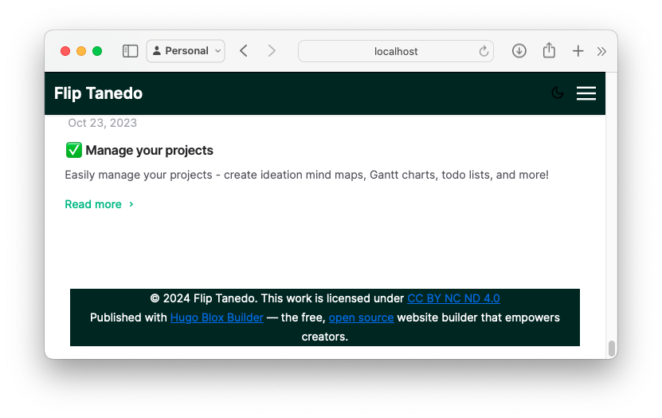

Okay! So it's not going to be easy. Referring back to the 2024 notes, we can see how we built up this framework. I think we can follow the same basic edits as before. 

### Make a new resume-biography block

We will want to modify the resume block (the first block with the profile photo) later. Because the resume block is a source of headaches when fixing the footer (see below), we should go ahead and make the new resume-biography block now. Make a copy of `./layouts_templates/partials/blox/resume-biography-3.html` and name it `./layouts/partials/blox/resume-biography-flip.html` . 

Go to `./content/_index.md` (do not confuse this with `./content/authors/_index.md`) and update the first block:

```md
sections:
  - block: resume-biography-flip
    content:	
```

This is important for the footer bar because we're going to 'paint' a few layers with background colors. The HugoBlox biography block adds a nice custom background for this block, but that background ends up being painted over by the solid colors. Fortunately, HugoBlox automatically creates `<section>` tags with ID equal to the block name. This means that in our CSS we can give the  ID `resume-biography-flip` (or whatever new name we use) a large z-value so that the background is visible over our re-painting. 

### Repainting? What?

I'd like the footer to be a solid color (same as the navbar) with some decorations on top. However, this turns out to be tricky. See the **Background** section above. In order to let the footer be a solid color, we need to make the entire page a solid color. But once we do that, we need to make the sections between the navbar and the footer white. 

In the past (pre-Fall 2024) I created a `<div id="THECONTENT">` that encapsulated everything between the navbar and the footer. In the CSS, I gave this ID a white background. With the new Tailwind system, this ended up leaving some ackward areas in the footer that were not properly colored (see Background above). 

It turns out that a more direct way of doing this is to color the `body` tag with the navbar color and then color the `PAGEBODY` ID (added below in `baseof.html`) white.  This makes you *think* you can just get rid of the `THECONTENT` ID. Wrong! For reasons that are not obvious to me, if you delete this div the page has a white bar on the bottom. What's really odd: you can color this ID or not even mention coloring this ID (empty CSS), and you fix the white bar problem. (Coloring this ID a different color will replace the erroneous white bar with the different color.) So you have to leave `THECONTENT` . Weird, but it works. 

Here's what it looks like if we set `THECONTENT` to have a pink background:


As a bonus for all of this, we are able to fix the annoying 'overscroll' issues where pulling the site past its formal boundary (something you can do in iOS and Firefox) does not pull up a white area, but rather a colored area to make it seem like the navbar or footer extends past the screen. 

Get it?

### baseof.html

Background: what is [baseof](https://gohugo.io/templates/base/#readout). This is the outer shell of the Hugo Blox structure.

Copy over `./layouts/_default/baseof.html` from `./layouts_templates`. It looks like this changed a bit from the Bootstrap version. I went ahead an added white space to make things easier to read. (Double check that this doesn't break anything by checking `hugo server -D`. )

1. Vanity: add a comment at the top of the page to note that I've edited the Hugo Blox template. Insert into Line 3.

   ```html
   <!doctype html>
   {{ "<!-- This site was created with Hugo Blox. https://hugoblox.com -->" | safeHTML }}
   {{ "<!-- Flip Tanedo has edited the Academic CV template. -->" | safeHTML }}
   {{ printf "<!-- Last Published: %s -->" (now | time.Format ":date_long") | safeHTML }}
   ```

2. Below the `<div class="page-header ...>` div and the `<div class="page body...>` div we open a new div: `<div id="THECONTENT">`. This is around line 31. 

   ```html
     <!-- FLIP ADD: opened a new div id="THECONTENT" for framing -->
     <div id="THECONTENT">
     <!-- Closed below; see ./assets/scss/custom.css -->
     <!-- /FLIP -->
       
     <div class="page-body {{if ne .Type "landing"}} my-10{{end}}">
   ```

   See how I displayed the `<div class="page-body...>` line just to help you orient yourself? You're welcome. You may want to pad things with more white space. 

   Let's go ahead close that new div. Let's place the closing `</div>` near the bottom, just above the `{{/* EXTENSIBILITY HOOK: BODY-END */}}`. 

   ```html
       <!-- FLIP ADD -->
       </div> <!-- closes id="THECONTENT" -->
       <!-- /FLIP -->
   
   
       {{/* EXTENSIBILITY HOOK: BODY-END */}}
       {{ partial "functions/get_hook" (dict "hook" "body-end" "context" .) }}
   
   
     </body>
   ```

   Now we have a container div for the entire visible area. Go ahead, if you color this div, it will color the entire area, including the region around the footer. 

   e.g. if we do this: ` <div id="THECONTENT" style="background-color: #012622; color: white">` then we get:
   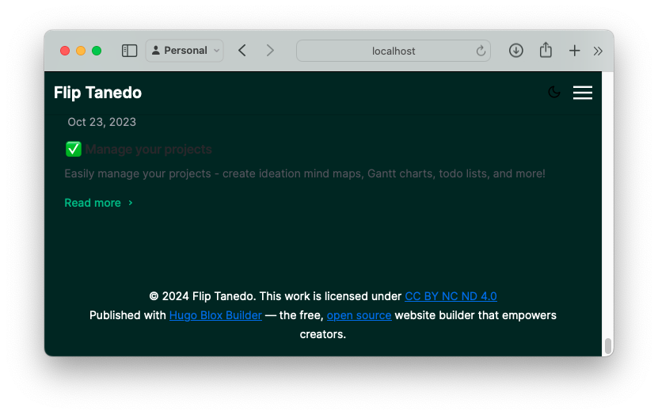
   Compare this to the image under **Background** in this section, above. Ok, now remove that styling because we're not coloring the entire site dark green.

3. Revise the `<div class="page body...">` tag around line 38 by giving it an `id` .

   ```html
   <!-- FLIP DEL -->
   <!-- <div class="page-body {{if ne .Type "landing"}} my-10{{end}}"> -->
   <!-- /FLIP -->
   <!-- FLIP ADD -->
   <div class="page-body {{if ne .Type "landing"}} my-10{{end}}" id="PAGEBODY">
   <!-- /FLIP -->
       {{ block "main" . }}{{ end }}
   </div>
   ```

   This will let us style the div that includes all of the blocks. Observe that this div surrounds the `{{ block "main" . }}{{ end }}`  Hugo call where all of the sections are inserted.

4. Now just above where we close the `THECCONTENT` div is a div called `page-footer`. Here's what it looks like initially:
   ```html
       <div class="page-footer">
         {{ partial "site_footer" . }}
       </div>
   ```

   And now you insert several more divs above the `{{ partial "site_footer" . }}`. 
   ```html
       <div class="page-footer">
         <!-- FLIP ADD -->
           <div style="position: relative; width: 0; height: 0">
             <div id="feynmanfoot" style="background-image:url('{{ $.Site.BaseURL }}/img/{{ .Site.Params.footmark }}');"></div>
           </div>
           <!--  -->
           <div id="botbar1"></div>
           <!--  -->
           <div id="FOOTERBAR"> <!-- closed after the site_footer code -->
           <!--  -->
         <!-- /FLIP -->
         <!-- ORIGINAL -->
             {{ partial "site_footer" . }}
         <!-- /ORIGINAL -->
         <!-- FLIP ADD -->
           </div> <!--  closes div FOOTERBAR-->
         <!-- /FLIP -->
       </div>
   ```

   * A div that is positioned relatively. It contains a nested div, `feynmanfoot` that contains the Feynman diagram.  <mark>I haven't saved the image nor have I updated the params file.</mark>
   * A `FOOTERBAR` div that surrounds the `site_footer` code.

If you copied over `./assets/css/custom.css`  then things should be looking pretty good right now. If you're confused about what some of the footer elements do, I suggest recoloring them temporarily to see where they show up.

### A total kludge

The layers of containers and backgrounds above are arranged to fix the "overscroll" color (keep the true background dark, but leave an area `#PAGEBODY` that is white). However, a side effect using a `id="PAGEBODY"` to set the background to be white means that the background of the biography widget is hidden. I thought this was being overwritten by the CSS. It turns out that the background was just buried. By fixing the z-index to be large, the background comes back. 

Here's what I noticed in the page source:

```html

<section id="section-resume-biography-flip" class="relative hbb-section blox-resume-biography-flip  dark" style="padding: 6rem 0 6rem 0;" >
 <div class="home-section-bg  bg-image" style="background-color: black;background-image: url(&#39;http://localhost:59799/media/ChalkboardBG_hu14443614070061421386.webp&#39;);background-size: cover;background-position: center;filter: brightness(1);">
   
 </div>	
```

I couldn't figure out where this is generated. It is part of the `{{block "main" .}}{{end}}` automatically generated HTML. You can see that the background image is generated and that there's an id for the section. So the kludge is to add in our CSS some styling to put this section at nonzero z index. 

```css
#section-resume-biography-flip
{
	/* This is a total kludge */
	/*	*/
	z-index: 1;
}
```

I'm surprised that this worked. It also let me avoid having to figure out where the shortcode is that generated the section tag. 

**Note**: Originally I put in a *large* z-index, 250. This led to a problem where the biography blog would scroll OVER the navbar. It turns out that z=1 is sufficient for our needs. 


Here's what happens if we did not add the z-index on `#section-resume-biography-flip`:

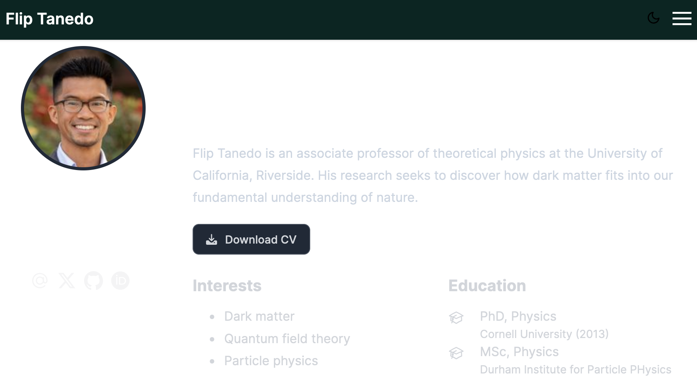

The beautiful background has disappered under the other background colors.

* Some hints about the section stuff: (I can't figure it out)
  * https://discourse.gohugo.io/t/creating-a-generic-section-template/954/2
  * https://cloudcannon.com/blog/the-ultimate-guide-to-hugo-sections/

## Fixing up the rest of the footer

The footer should look like this:


Let's work on that region below the Feynman diagram. The default footer style is stored as

`./layouts/partials/components/footers/minimal.html`.

Go ahead and copy this from `./layouts_templates/` and paste it into `./layouts./...` , renaming it to `./layouts/partials/components/footers/flipfoot`. 

Go to `./config/_default/params.yaml` and use `flipfoot` as the block:

```yaml
# Site footer
footer:
  blox: "flipfoot"
    notice: '© {year} Me. This work is licensed under {license}'
    license:
      enable: true
      allow_derivatives: false
      share_alike: true
      allow_commercial: false
```

Note that previously in the Bootstrap version of HugoBlox this line was `  block: flipfoot`. 

Now we edit `./layouts/partials/components/footers/flipfoot.html`. Unfortunately my edits from 2024 do not carry over since that used the Bootstrap grid. Fortunately, it is not too hard to create the analogous grid in Tailwind. For three columns, the structure is:

```html
<div class='grid sm:grid-cols-3'>
	<div>1</div>
	<div>2</div>
	<div>3</div>
</div>
```

The `sm:grid-cols-3` tells tailwind that the next three [sub-]divs should appear in consecutive columns if the screen size is *at least* `sm`. 

We can now copy over the site-footer divs from last year. There are some tweaks we'll need.

### Font Awesome Fix (temp?)

Also an experiment with the [hook system](https://docs.hugoblox.com/reference/extend/). Create the following file: `.layouts/partials/hooks/head-end/font-awesome-flip.html`

Font Awesome installation (this was mine, you should get your own):

```html
<script src="https://kit.fontawesome.com/ae82ca92c2.js" crossorigin="anonymous"></script>`
```

This seems to have fixed a problem where the Creative Commons Font Awesome logos were not showing up. (I assume this problem will be fixed separately)

## Site License 

Tweak `./layouts/partialss/site_footer_license.html` at this point:

```html
<!-- FLIP DEL -->
  <!-- <p class="powered-by footer-license-icons"> -->
<!-- /FLIP -->
<!-- FLIP ADD --> <!-- add centering -->
  <p class="powered-by footer-license-icons text-center">
<!-- /FLIP -->
```

This is to center the Creative Commons icons. 

### CSS tweaks for the footer

These are some items I've added to `./assets/css/custom.css` for the footer: 

```css
.powered-by{
  color: #065522;
  text-decoration: none;
}

.powered-by a:link{
  color: #079669;
  text-decoration: none;
}
```

### How it should look

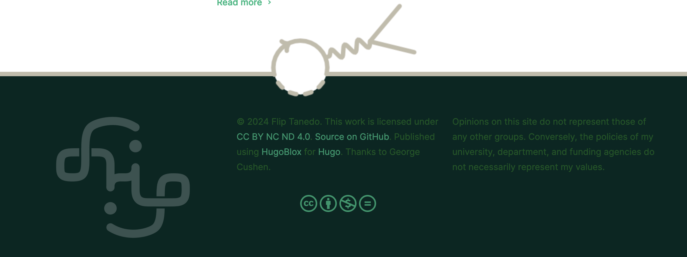

And it should look reasonable on a small screen. 

## Creating a template block

The older Bootstrap HugoBlox template had these great two column responsive template (markdown) blocks

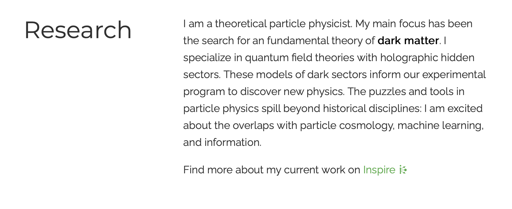

As of this writing the Tailwind Hugoblox version does not yet have such a template. However, it looks like it should be relatively straightforward to adapt such a block from the original `markdown` block in the Bootstrap version.

### A working Markdown block

(Updated 12/26/24)

Here's what it looks like:

```html
<div class="flex flex-col gap-8 justify-center w-full px-6 md:flex-row">

  <!-- LEFT COLUMN/TITLE -->
  <div class="flex text-3xl font-bold mb-2 text-gray-900
  dark:text-white w-full md:w-48 justify-center">
      <div>{{ $title }}</div>
  </div>

  <!-- RIGHT COLUMN/BODY -->
  <div class="flex-auto max-w-prose">
    <div class="prose max-w-prose prose-slate lg:prose-xl
    dark:prose-invert">
    {{ with $text }}
    {{ . | markdownify }}
    {{ end }}
    </div>
  </div>
  
</div>
```

Features:

* Title text is center justified in 1on column, top justified in 2 column mode. Something about the Tailwind styling made this really difficult to do out-of-the box. I had to follow the Hugo Blox documentation to recompile Tailwind through Blox. 
* Columns are aligned with the biography block so the whole page has clean lines.
* The body text is large for large screens. 


## Font

The Bootstrap version of HugoBlox handled fonts with a separate TOML file. At the time of this writing, the present Tailwind version does not yet have such an interface. The key html is as follows:

````html
  <style>
    @font-face {
      font-family: 'Inter var';
      font-style: normal;
      font-weight: 100 900;
      font-display: swap;
      src: url(/dist/font/Inter.var.woff2) format(woff2);
    }
  </style>
````

You can find this in `layouts_templates/partials/site_head.html`:

```go
 {{/* Load font theme */}}
  {{ $font_family := "Inter var" }}
  {{ $font_file := "" }}
  {{ $font_type := "" }}
  {{ if eq site.Params.appearance.font "serif" }}
    {{ $font_file = "RobotoSlab-VariableFont_wght.ttf" }}
    {{ $font_type = "truetype" }}
  {{else}}
    {{ $font_file = "Inter.var.woff2" }}
    {{ $font_type = "woff2" }}
  {{end}}
  {{ $font := resources.Get (printf "dist/font/%s" $font_file) }}
  <style>
    @font-face {
      font-family: '{{$font_family}}';
      font-style: normal;
      font-weight: 100 900;
      font-display: swap;
      src: url({{ $font.RelPermalink }}) format({{$font_type}});
    }
  </style>
```

I think it is not too had to have the Hugo variables (e.g. `$font_family`) pull from the `.config/_default/params.yaml` file. However, I expect this to be updated in a future HugoBlox version so there's no need to reinvent the wheel. For now, let me make my own copy  `./layouts/partials/site_head.html` where the font is loaded by hand.

Let's use [Raleway](https://fonts.google.com/specimen/Raleway), a variable width font available on Google Fonts. Grab the embed code. Google gives the following for `<head>`:

```html
<link rel="preconnect" href="https://fonts.googleapis.com">
<link rel="preconnect" href="https://fonts.gstatic.com" crossorigin>
<link href="https://fonts.googleapis.com/css2?family=Raleway:ital,wght@0,100..900;1,100..900&display=swap" rel="stylesheet">
```

n.b. you can also use the `@import` method.

And for CSS:

```css
// <uniquifier>: Use a unique and descriptive class name
// <weight>: Use a value from 100 to 900

.raleway-<uniquifier> {
  font-family: "Raleway", sans-serif;
  font-optical-sizing: auto;
  font-weight: <weight>;
  font-style: normal;
}		
```

Here's how we use that information. Let's go to `./layouts/partials/site_head`:

```html
  <!-- FLIP DEL -->
  <!-- 
  <style>
    @font-face {
      font-family: '{{$font_family}}';
      font-style: normal;
      font-weight: 100 900;
      font-display: swap;
      src: url({{ $font.RelPermalink }}) format({{$font_type}});
    }
  </style>
  -->
  <!-- /FLIP -->
  <!-- FLIP ADD -->
  <style>
  @import url('https://fonts.googleapis.com/css2?family=Raleway:ital,wght@0,100..900;1,100..900&display=swap');
  </style>
  <!-- /FLIP  -->
```

We're putting the `@import` call in here. Now go to `./assets/css/custom.css` and paste the following on top:

```css
   /*
  ////////////////////
 //  FONT UPDATE   //
////////////////////
*/

body {
  font-family: "Raleway", sans-serif;
  font-optical-sizing: auto;
  font-weight: 100 900;
  font-style: normal;
}
```

With this, the font should be updated. 


## CV Widget

The CV widget is adapted from the new Markdown template. 

### Left column

We modify the left column to include the group icon and CV download link.

```html
  <!-- LEFT COLUMN/TITLE -->
  <div class="flex text-3xl font-bold mb-2 text-gray-900
  dark:text-white w-full md:w-48 justify-center">
    <!-- Extra flex for column -->
    <div class="flex flex-col">
        <div>{{ $title }}</div>
        <!--  -->
        {{ with $block.content.group_logo }}
        <div>
          
        </div> 
        {{ end }}
        <!--  -->
        {{ with $block.cv_pdf }}
        <div class="mt-4" style="margin-left:auto; margin-right: auto;">
        <a href="{{.url}}" class="inline-flex items-center px-4 py-2 text-sm font-medium text-gray-900 bg-white border border-gray-200 rounded-lg hover:bg-gray-100 hover:text-primary-700 focus:z-10 focus:ring-4 focus:outline-none focus:ring-gray-200 focus:text-primary-700 dark:bg-gray-800 dark:text-gray-300 dark:border-gray-600 dark:hover:text-white dark:hover:bg-gray-700 dark:focus:ring-gray-700">
          <svg class="w-3.5 h-3.5 me-2.5" aria-hidden="true" xmlns="http://www.w3.org/2000/svg" fill="currentColor" viewBox="0 0 20 20">
            <path d="M14.707 7.793a1 1 0 0 0-1.414 0L11 10.086V1.5a1 1 0 0 0-2 0v8.586L6.707 7.793a1 1 0 1 0-1.414 1.414l4 4a1 1 0 0 0 1.416 0l4-4a1 1 0 0 0-.002-1.414Z"/>
            <path d="M18 12h-2.55l-2.975 2.975a3.5 3.5 0 0 1-4.95 0L4.55 12H2a2 2 0 0 0-2 2v4a2 2 0 0 0 2 2h16a2 2 0 0 0 2-2v-4a2 2 0 0 0-2-2Zm-3 5a1 1 0 1 1 0-2 1 1 0 0 1 0 2Z"/>
          </svg> 
          {{.text}} <!-- Download Full CV  -->
        </a>
      </div>
        {{ end }}
    </div>
  </div>

```

### Right column

We place the following *inside* the right column divider:

```html
<!-- For interests/education -->
    <div class="grid grid-cols-1 md:grid-cols-2 gap-4 justify-between mt-6 dark:text-gray-300">

      <!-- INTERESTS -->
      {{ with $person.interests }}
        <div class="">
          <div class="section-subheading mb-3">
          <!-- {{ i18n "interests" | markdownify }} -->
          Research
          </div>
          <!-- <ul class="list-disc list-inside space-y-1 pl-5"> -->
          <ul>
            {{ range . }}
            <li>
              {{ . | markdownify | emojify }}
            </li>
            {{ end }}
          </ul>
        </div>
      {{ end }}

      <!-- EDUCATION -->
      {{ with $block.education }}
        <div class="">
          <div class="section-subheading mb-3">{{ i18n "education" | markdownify }}</div>
          <ul class="">
            {{ range . }}
            <li class="flex items-start gap-3">
              {{ if .logo }}
                
              {{ else }}
                {{ partial "functions/get_icon" (dict "name" "academic-cap" "attributes" "style=\"\" class='flex-shrink-0 w-5 h-5 me-2 mt-1'") }}
              {{ end }}
              <!-- <div class="description"> -->
                {{ .course_short }}{{ with .institution_short }}, {{ . }}{{ end }}
                {{ with .year }}({{ . }}){{ end }}
                <br />
              <!-- </div> -->
            </li>
            {{ end }}
          </ul>
        </div>
      {{ end }}

    </div> <!-- /interests & education column -->
```

Also, adding the service bit:

```
   <!-- SERVICE -->
    {{ with $block.service }}
      <div style="font-size: .8rem; padding-top: 2em;">
        <b>Service</b>:
        {{ range . }}
        {{ .thing | markdownify }} &middot;
        {{ end }}
      </div>
    {{ end }}
```


# Refining the home page

## Icon bar (resume-biography-flip)

### Moving the Icon Bar

The icon bar lives in `./resume-biography-flip.html`:

```html
    <ul class="network-icon dark:text-zinc-100">
      {{ range $person.profiles }}
      {{ $pack := or .icon_pack "fas" }}
      {{ $pack_prefix := $pack }}
      {{ if in (slice "fab" "fas" "far" "fal") $pack }}
        {{ $pack_prefix = "fa" }}
      {{ end }}
      {{ $link := .url | default .link }}
      {{ $scheme := (urls.Parse $link).Scheme }}
      {{ $target := "" }}
      {{ if not $scheme }}
        {{ $link = (.url | default .link) | relLangURL }}
        {{ if eq (path.Ext $link) ".pdf" }}{{ $target = "target=\"_blank\" rel=\"noopener\"" }}{{ end }}
      {{ else if in (slice "http" "https") $scheme }}
        {{ $target = "target=\"_blank\" rel=\"noopener\"" }}
      {{ end }}
      <li>
        <a href="{{ $link | safeURL }}" {{ $target | safeHTMLAttr }} aria-label="{{ .icon }}"
           {{ with .label }} data-toggle="tooltip" data-placement="top" title="{{.}}"{{ end }}>
          {{ partial "functions/get_icon" (dict "name" .icon "attributes" "style=\"height: 1.5rem;\"")  }}
        </a>
      </li>
      {{ end }}
    </ul>	
```

We're going to move this to below the `{{ with $block.content.button }}` line int he same file. This is moving it from the left column to nearly the bottom of the second column. You can throw in a line break `<br />` or two for spacing.

### Updating the Icon Bar

Where is the list of icons stored? It is not in `./content/_index.md`. Observe that Hugo runs over `range $person.profiles`. This means we should go look under `./content/authors/admin/_index.md`. Here you find the profiles list, which I've now updaetd:

```yaml
profiles:
  - icon: at-symbol
    url: 'mailto:flip.tanedo@ucr.edu'
    label: E-mail Me
  - icon: brands/x
    url: https://twitter.com/FlipTanedo
  - icon: brands/github
    url: https://github.com/fliptanedo
  - icon: academicons/orcid
    url: https://orcid.org/0000-0003-4642-2199
  - icon: academicons/inspire
    url: https://inspirehep.net/author/profile/P.Tanedo.1
  - icon: academicons/google-scholar
    url: https://scholar.google.com/citations?hl=en&user=BQuJtTIAAAAJ&view_op=list_works&sortby=pubdate
  - icon: academicons/arxiv
    url: https://arxiv.org/search/?searchtype=author&query=Tanedo%2C+P
  - icon: brands/linkedin
    url: https://www.linkedin.com/in/flip-tanedo-524137221/
  # - icon: publons
  #   icon_pack: ai
  #   link: https://publons.com/author/637273/philip-tanedo#profile
  # - icon: slideshare
  #   icon_pack: fab
  #   link: https://www.slideshare.net/fliptanedo
  # - icon: tree-solid
  #   url: https://academictree.org/physics/tree.php?pid=715850
```

Note the commented out icons. Some of these (publons, slideshare) I no longer use. Others (academictree) are not on academicians. I tried downloading the tree-solid svg from fontawesome and placing it into `./assets/media/icons/hero` but it didn't get colored like the other icons:

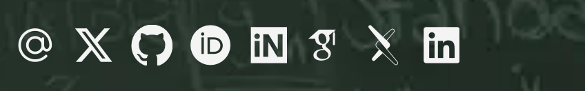

You can download a white svg, but then it doesn't get colored when mouseovered:

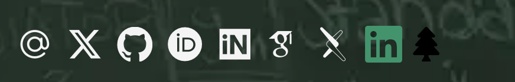

<mark>Something to sort out for later. How do we include other font awesome fonts? How do we include custom svgs?</mark>

## Links (resume-biography-flip)

Adding links to the professional blurb.

Here's how it was last time. It uses the fontawesome icons directly rather than using the svg code that Hugo Blox now defaults to. 

```
<i class="fas fa-download  pr-1 fa-fw"></i> Download his 
<a href="/files/Tanedo.pdf" target="_blank">CV</a>
 |  
<i class="fas fa-user  pr-1 fa-fw"></i> A professional 
<a href="./post/bio/">biosketch</a>.
```

In `./layouts/partials/blox/resume-biography-flip.html`:

```html
   <!-- FLIP -->
    <!-- Deleted old button -->
    {{ with $block.content.buttons }}
    {{ range $block.content.buttons }}
    <a href="{{.url}}" target="_blank" class="inline-flex items-center px-4 py-2 text-sm font-medium text-gray-900 bg-white border border-gray-200 rounded-lg hover:bg-gray-100 hover:text-primary-700 focus:z-10 focus:ring-4 focus:outline-none focus:ring-gray-200 focus:text-primary-700 dark:bg-gray-800 dark:text-gray-300 dark:border-gray-600 dark:hover:text-white dark:hover:bg-gray-700 dark:focus:ring-gray-700">
    <i class="fas {{.fontawesome}} pr-1 fa-fw"></i> &nbsp; 
    {{.text}}
    </a> &nbsp; 
    {{ end }}
    {{ end }}
    <!-- /FLIP -->
```

The `&nbsp;` is a non-breaking space.

Here's what it looks like in `./content/_index.md`:

```yaml
      # Show a call-to-action button under your biography? (optional)
      # button:
      #   text: Download CV
      #   url: uploads/resume.pdf
      # Have a few buttons 
      buttons:
        - text: Download CV
          fontawesome: fa-download
          url: uploads/resume.pdf
        - text: Professional Biosketch
          fontawesome: fa-user
```

We commented out the old version. 

## Comment blurb

```html
    {{ with ($block.content.blurb | emojify | $page.RenderString) | default $person_page.Content }}
    <br /><br />
    <div class="flex-auto">
    <!-- <p> -->
    <div class="comment" style="text-align: left;">
        {{ . | markdownify | emojify }}
    </div>
    <!-- </p> -->
    </div>
    {{ end }}
```

## Interests/Education List 

### Move Lists to CV (flip_cv.html)

We move the **Interests** and **Education** section from `./layouts/partials/blox/resume-biography-flip.html` to `./layouts/partials/blox/resume-biography-flip.html`.

Here's where it ends up:

```html

  <div class="flex-auto max-w-prose md:mt-12">
    
    {{ with $text }}<div class="prose prose-slate lg:prose-xl dark:prose-invert max-w-prose">{{ . }}</div>{{ end }}


    <!-- INTERESTS AND EDUCATION (moved from biography) -->
    <div class="grid grid-cols-1 md:grid-cols-2 gap-4 justify-between mt-6 dark:text-gray-300">

        {{ with $person.interests }}
        <div class="">
          <div class="section-subheading mb-3">{{ i18n "interests" | markdownify }}</div>
          <ul class="list-disc list-inside space-y-1 pl-5">
            {{ range . }}
            <li>
              {{ . | markdownify | emojify }}
            </li>
            {{ end }}
          </ul>
        </div>
        {{ end }}

        {{ with $person.education }}
        <div class="">
          <div class="section-subheading mb-3">{{ i18n "education" | markdownify }}</div>
          <ul class="">
            {{ range . }}
            <li class="flex items-start gap-3">
              {{ partial "functions/get_icon" (dict "name" "academic-cap" "attributes" "style=\"\" class='flex-shrink-0 w-5 h-5 me-2 mt-1'") }}
              <div class="description">
                <p class="course">{{ .area }}{{ with .year }}, {{ . }}{{ end }}</p>
                <p class="text-sm">{{ .institution }}</p>
              </div>
            </li>
            {{ end }}
          </ul>
        </div>
        {{ end }}

    </div>
    <!-- /INTERESTS and EDUCATION -->

  </div>


```

Note that we copied and pasted *inside* the division `<div class="flex-auto max-w-prose md:mt-12">` that contains the pre-existing text insertion `{{ with $text }}<div class="prose prose-slate lg:prose-xl dark:prose-invert max-w-prose">{{ . }}</div>{{ end }}`.

### Custom Icons for Education

Here's the revision:

```html
<!-- REVISED VERSION -->
      <!-- Changed from $person to $block -->
      {{ with $block.education }}
      <div class="">
        <div class="section-subheading mb-3">{{ i18n "education" | markdownify }}</div>
        <ul class="">
          {{ range . }}
          <li class="flex items-start gap-3">
            {{ if .logo }}
              
            {{ else }}
              {{ partial "functions/get_icon" (dict "name" "academic-cap" "attributes" "style=\"\" class='flex-shrink-0 w-5 h-5 me-2 mt-1'") }}
            {{ end }}
            <!-- <div class="description"> -->
              {{ .course_short }}
              {{ with .institution_short }}, {{ . }}{{ end }}
              {{ with .year }}({{ . }}){{ end }}
              <br />
            <!-- </div> -->
          </li>
          {{ end }}
        </ul>
      </div>
      {{ end }}

```

I made a few other minor tweaks. Just be sure to copy the latest `flip_cv.html` version.

### Loading Academicons

We'll use Hugo Blox's [hook system](https://docs.hugoblox.com/reference/extend/). Create the following file: `.layouts/partials/hooks/head-end/academicons-flip.html`. 

```html
<!-- Load Academicons -->
<!-- https://jpswalsh.github.io/academicons/ -->
<link rel="stylesheet" href="https://cdn.jsdelivr.net/gh/jpswalsh/academicons@1/css/academicons.min.css">

```

This mirrors how we called Font Awesome.

How to use these: 

```
<i class="ai ai-inspire ai"></i>
```

Also for fontawesome:

```
<i class="fa-regular fa-flask"></i>
```


## Spacing of blocks

After moving the Interests/Education block, the vertical spacing seems a bit off for the biography (`blox-resume-biography-flip`) block:


Oh shoot, this is in the docs: https://docs.hugoblox.com/getting-started/page-builder/#spacing. Here's how to do it. In `./content/authors/admin/_index.md`  go to `sections:`/`-block: resume-biography-flip`  and insert the following:

```yaml
    design:
      spacing: 
        padding: ['5rem', '0', '10rem', '0']
```

When I was trying to kludge this, I kept messing up because I didn't appreciate that the expected input for `padding` is an array of strings. See the background subsection directly below.

### Background: some spelunking for how this works

The spacing is dictated by the styling of the `section` tag, which one can see in the html source:

```html
<section id="section-resume-biography-flip" class="relative hbb-section blox-resume-biography-flip  dark" style="padding: 6rem 0 6rem 0;" >
```

Where does this `section` tag come from? If you search (e.g. `grep`) through the HugoBlox template files (`./layouts_templates/`) you'll find that these are inserted in `./layouts_templates/partials/functions/parse_block_v2.html` around line 136:

```html
{{/* Dedicated child div for bg prevents parallax 100% height issue within new CSS grid page wrapper. */}}
<section id="{{$hash_id}}" class="relative hbb-section {{$widget_class}} {{if $bg.text_color_light}}dark{{else if (eq $bg.text_color_light false)}}light{{end}} {{with $css_classes}}{{.}}{{end}}" {{with $style}}style="{{. | safeCSS}}"{{end}} {{print $extra_attributes | safeHTMLAttr}}>
```

So it looks like the key part is `{{with $style}}style="{{. | safeCSS}}"{{end}}`. In turn, `$style` is defined around line 34:

```go
{{/* Begin widget styling */}}
{{ $bg := $block.design.background }}
{{ $style := "" }}
```

The subsequent lines keep adding things to the `$style` variable. In fact, around like 84 we see the key spot:

```go
{{ with $block.design.spacing.padding }}
  {{ $style_pad := printf "padding: %s;" (delimit . " ") }}
  {{ $style = print $style $style_pad }}
{{ else }}
  {{ with $page.Params.design.spacing }}
    {{/* Fallback to default section spacing setting */}}
    {{ $style_pad := printf "padding: %s 0 %s 0;" . . }}
    {{ $style = print $style $style_pad }}
  {{ end }}
{{ end }}
```

Note that the `(delimit . " ")` is a hint that the padding input is an array. 

## Coloring the Home Sections

One of the challenges in the past was coloring each of the partials (sections) on the home screen. In older versions of the Academic theme, the home page would automatically alternate between white and `#F7F7F7` (light gray) backgrounds. This was a subtle visual indicator that separated different sections of the home page. However, it was a bit of a headache for me because I always wanted the bottom section to be white in order to merge seamlessly into the Feynman footer figure, which assumes a white background to give the visual effect of "cutting into" the footer bar: 

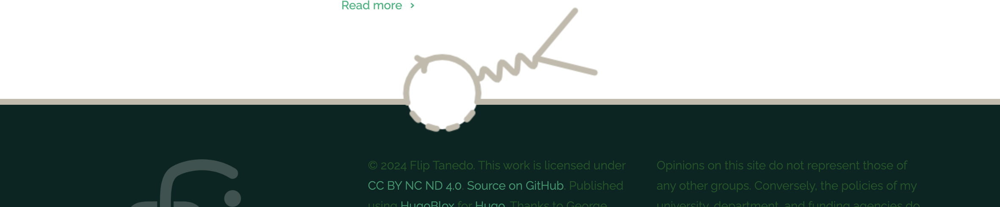

It turns out that this is quite easy.  See the section on  [Styling](https://docs.hugoblox.com/getting-started/page-builder/#style) in the Hugo Blox docs. In each block, you can simply specify the `css_style` that should be inserted into the `<section>` tag. 

```yaml
design:
      columns: '2'
      css_style: 'background-color: #F7F7F7;'
```

Doing this in the Flip Markdown block gives

```html
<section id="section-flip_markdown" class="relative hbb-section blox-flip-markdown  " style="padding: 6rem 0 6rem 0;background-color: #F7F7F7;" >
```

This is processed in `./layouts_templates/partials/functions/parse_block_v2.html`.

### The Old Way

Observe in our `./assets/css/custom.css ` that `.blox-flip-cv`  changes the background color of the section. This is because Hugo encloses each section in a tag:

```html
<section id="section-flip_cv" class="relative hbb-section blox-flip-cv  " style="padding: 6rem 0 6rem 0;" >
```

where the `id` is "section-`partial_name`" and the class automaticaly contains "blox-`partial_name`." In this example, the partial is called `flip_cv`. You can see how you can get alternating background colors by specifying the background color in the CSS for each uniquely defined block. 

~~In the future we can let the block background color be something we specify in `./content/_index.md`, but for now we can do it manually.~~


## Teaching Page

The teaching page is a useful template for icons and lists. Start by copying the `./layouts/paritals/flip_markdown.html` page and make a `./layouts/partials/flip_teaching.html`. 

The structure of the `./content/_index.md` block is

```
  - block: flip_teaching
    content: 
      title: Teaching
    class:
      - name: Math Methods
        number: P17
        session: Spr 2023
        photo: P017-2021.png
        website: 'https://sites.google.com/ucr.edu/physics017/'
      - name: Math Methods
        number: P231
        session: Fall 2022
        photo: P231-2017.png
        website: 'https://sites.google.com/ucr.edu/p231/'
    oldclass:
      - name: General Physics
        number: P40B
        session: Spr 2020
        photo: P40B-2020.png
        website: 'https://sites.google.com/ucr.edu/physics40b-s20/home'
    olderclass:
      - name: Math Methods
        number: P231
        session: Fall 2017
        photo: P231-2017.png
        website: 'https://github.com/Tanedo/P231-2017'
```

The `class` list is shown with icons. When that gets too long, I move it to the `oldclass` list which is just shown as text. Ancient courses are listed in `olderclass` which are not displayed at all. 

### Structuring the template

As a shortcut, we will not actually embrace responsive design.

<mark>Okay. At this point, I got so frustrated trying to hack together tailwind commands from the default Hugo Blox framework. I'm just going to install tailwindcss.</mark>

*Okay, once I let myself use Tailwind to put things together this was pretty straightforward* 

I changed my responsive design to a 4-column grid for large screens and a 2-column grid for small screens. The 2-column grid lists the text to the right of the icon, not below. This fills out the space nicely. (And I stumbled upon this accidentally.)

##  Carousel

From ChatGPT.

In your Hugo project, open your `layouts/_default/baseof.html` file and add the Swiper CSS and JS links inside the `<head>` and just before the closing `</body>` tag respectively.

```html
<head>
  <!-- Other head content -->
  <link rel="stylesheet" href="https://unpkg.com/swiper/swiper-bundle.min.css" />
</head>

<body>
  <!-- Your content here -->
  <script src="https://unpkg.com/swiper/swiper-bundle.min.js"></script>
</body>
```

Alternatively, you can add it to your `assets` folder and reference it locally if you prefer to host it yourself.

We'll do this by using the [hooks system](https://docs.hugoblox.com/reference/extend/): To inject your code into one of the above places, create a file at `layouts/partials/hooks/<hook>/<your-filename>.html`, replacing `<hook>` with one of the hook names above and `<your-filename>`with any name, such as `custom`. You’ll need to create these new folders relative to the root of your site.

The `<hook>` directories are **head-start**, head-end, **body-end**, footer-start. The bolfaced ones are the ones we'll need. 

# Filling in other pages

At this stage most of the template is set up. Now let's fill in the content.

## Content Subfolders

You can create your own subfolders. This is how the `./layouts_templates/partials/blox/collection.html` block works. It goes through a named subfolder pulls out the content.

### Weird bar on non-home pages?!

As set up, the non-home pages will have an odd footer:


This weird dark band is due to a margin on a divider of class `my-10`. The way to solve this is set this class to have zero top/bottom margins. (It's either top or bottom, but I set both to zero.) In `./assets/css/custom.css`:

```
.my-10 {
    margin-top: 0rem;
    margin-bottom: 0rem;
}
```


### One offs

Create a directory `./content/info/`.

This is where I put my biography. The `./layouts_templates/partials/blox/collection.html` widget is what Hugo Blox uses to pull "articles" from the `./content` folder. With an eye for expansion, it pays off to organize the non-home pages into subfolders.

## 404 Page

Not bad to edit.

# Deployment

**Background**: my domain name points to a folder on a remote server. I do not want to download much onto the remote server. I'm happy to just synchronize the "deply" folder (`htdocs`) .

Tool to use: **Rsync**, [Hugo Documentation on Rsync](https://gohugo.io/hosting-and-deployment/deployment-with-rsync/)

What it does: Rsync is not a version control system (e.g. Git is a version control system), but it "upgrades" SFTP by only uploading files that have been updated relative to the remote that you're pushing to.

I previously thought I could run a `cron` job on the remote sever that pulls from GitHub. However, the default GitHub deployment does *not* have a readily accessible `./public/` folder (the folder that Hugo dumps the static site into). Instead of futzing with this, I can just use Rsync locally.

### Server

For UCR site: use [vhost]((https://websites.ucr.edu/frequently-asked-questions#how-do-i-access-vhost)), you need to be on the UCR VPN to log in. Otherwise you will not be able to log in and there is no obvious error message. 

Hugo recommends [copying an SSH key to the host](https://gohugo.io/hosting-and-deployment/deployment-with-rsync/) to "make logging in to your server more secure and less interactive." Note that in the instructions, you are asked to generate a passphrase: "Not using a passphrase will let you transfer files non-interactively, as you won’t be prompted for a password when you log in, but it is slightly less secure." 


# Notes

* Colors
  * Dark green for header: `background-color: #012622`; I may want to go with a dark moss green rather than a dark pine green.
  * `#F7F7F7` is the very light gray that the old Bootstrap template used to differentiate sections. 
  * A nice green color for fonts: `#4CAF50`
  * I may want to make a more transparent version of my amibgram for the footer
* Do I want the profile picture to be larger and higher res? The default template processes the profile image through a Hugo algorithm to shrink the file size. However, these profile pictures are significant when department pull photos for seminar flyers. 
* From George Cushen on Discord: 10/29/2023 (is that date possibly right?)

  * Resizing the profile picture can be done purely by adding custom CSS (either using the documented Custom CSS file, or adding it to the end of your `template.scss`:

    ```
    .wg-about-avatar .avatar {
      width: 100% !important;
      height: 100% !important;
      max-width: unset !important;
    }
    
    .wg-about-avatar .avatar-wrapper {
      width: 350px !important;
      height: 350px !important;
    }
    ```

    As for resolution of the image itself, the resolution is reduced with Hugo for optimizing website performance. To increase the image resolution, override the block or create your own version of the block and increase the resolution passed to Hugo's image processing here: https://github.com/wowchemy/wowchemy-hugo-themes/blob/f55ff594c0f63899a8af893f33bd62ceb77cc8fd/modules/wowchemy/layouts/partials/blocks/about.avatar.html#L29

    

    You can also increase the quality of the image by changing Hugo's image processing quality option to something higher such as 95 in your Hugo config.yaml: https://github.com/wowchemy/wowchemy-hugo-themes/blob/ed188eb822c985952e1c927f776b034368ab970f/starters/academic/config/_default/config.yaml#L50

### For Next Time

* In dark-mode the vertical scroll bar has a dark background that looks like a right-most border. In light-mode the vertical scroll bar is invisible.

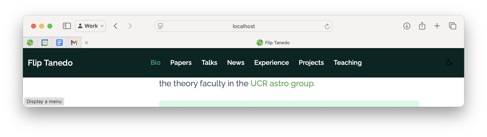

* Currently custom css is only inserted in `./assets/css/custom.css`. This is called by the default `site_head.html` partial at `.layouts_templates/partials/site_head.html`:
  ```html
     82:   {{ if fileExists "assets/css/custom.css" }}
     83:     {{ $styles := resources.Get "css/custom.css" | minify | fingerprint "sha256" }}
     84      <link href="{{ $styles.RelPermalink }}" rel="stylesheet" />
     85    {{ end }}
  ```

  In the future, I could split up the `custom.css` file to make things more portable. e.g. the slider css could be placed elsewhere.
  
* Figure out what template the non-home pages are using. There are a lot of little things that I'd like to remove, e.g. the social media row at the bottom of these pages. 
  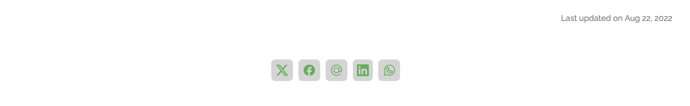

