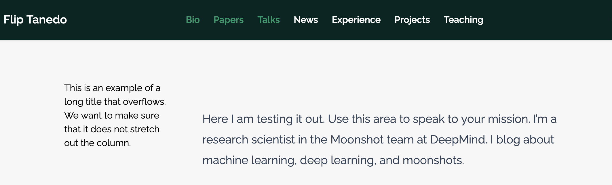
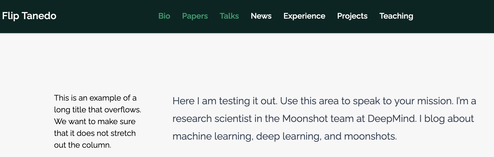
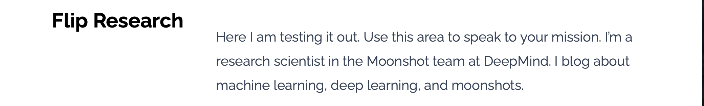
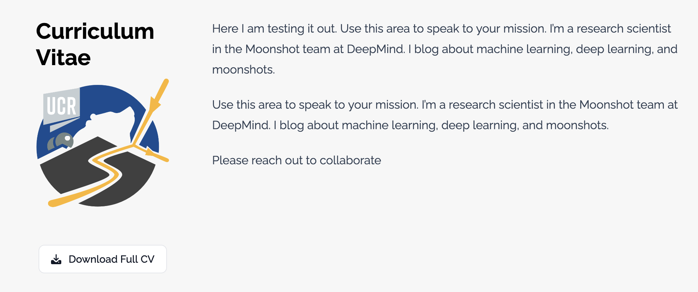

# Obsoloete notes; historical only

from `flipwebsite2025/README.md`

### Old Notes

* Responsive design: the phone view looks weird for default blox: no margin. 
  * Geo fixed this here: https://github.com/HugoBlox/hugo-blox-builder/commit/4f621dfa3a5ab798bea17ad2760bd61815c76f25


## Template block

### OLDER: An initial attempt

From `./layouts_tempaltes/partials/blox/markdown.html`

```html
<div class="flex flex-col items-center max-w-prose mx-auto gap-3 justify-center px-6">

  <div class="mb-6 text-3xl font-bold text-gray-900 dark:text-white">
    {{ $title }}
  </div>

  {{ with $text }}
  <div class="prose prose-slate lg:prose-xl dark:prose-invert max-w-prose">{{ . }}
  </div>
  {{ end }}
  
</div>
```

How I played with this: make a test copy of `resume-biography-flip` and star hacking away to see if we can break it down into two columns.

Here's the problem:



(Note: in this image I've already colored the background. More on this in a bit.) This corresponds to 

```html
<div class="px-3 flex flex-col md:flex-row justify-center gap-12">
  
  <!-- <div class="md:w-48 flip-section-title"> -->
  <div class="md:w-48">
       <div>{{ $title }}</div>
  </div>

  <div class="flex-auto max-w-prose md:mt-12">
    {{ with $text }}<div class="prose prose-slate lg:prose-xl dark:prose-invert max-w-prose">{{ . }}</div>{{ end }}
  </div>

</div>
```

We fix this by using `<div class="md:w-48 flip-section-title">` (commented out above), where we define `flip-section-title` in `./assets/css/custom.css`:

```css
.flip-section-title{
  padding: 3rem 10px 0px 0px;
}

.blox-flip-cv{
  background-color: #F7F7F7;
}
```

This gives us:



Note that the 3rem padding lined up the first column text with the second. Also observe how `.blox-flip-cv`  changed the background color of the section. This is because Hugo encloses each section in a tag:

```html
<section id="section-flip_cv" class="relative hbb-section blox-flip-cv  " style="padding: 6rem 0 6rem 0;" >
```

where the `id` is "section-`partial_name`" and the class automaticaly contains "blox-`partial_name`." In this example, the partial is called `flip_cv`. You can see how you can get alternating background colors by specifying the background color in the CSS for each uniquely defined block. 

<mark> This last paragraph is now included above under **Coloring the Home Sections**. In the future we can let the block background color be something we specify in `./content/_index.md`, but for now we can do it manually.</mark>


### OLDEST Notes on the existing Markdown Block

From `./layouts_tempaltes/partials/blox/markdown.html`

```html
<div class="flex flex-col items-center max-w-prose mx-auto gap-3 justify-center px-6">

  <div class="mb-6 text-3xl font-bold text-gray-900 dark:text-white">
    {{ $title }}
  </div>

  {{ with $text }}
  <div class="prose prose-slate lg:prose-xl dark:prose-invert max-w-prose">{{ . }}
  </div>
  {{ end }}
  
</div>
```

This does not give the two column split that I'm looking for. Let us draw inspiration from the Bootstrap version of HugoBlox. Here, the two column markdown layout matched the break poitns of the about widget. That is: at some common break point, all home page elements became one column. To be efficient, we can just follow the structure of the `resume-biography` block. 

(How I played with this: make a test copy of `resume-biography-flip` and star hacking away to see if we can break it down into two columns.)

The result is:

```html
<div class="resume-biography px-3 flex flex-col md:flex-row justify-center gap-12">
  <div class="flex-none m-w-[130px] mx-auto md:mx-0">

    <div id="profile" class="flex justify-center items-center flex-col">
      <div class="portrait-title dark:text-white">
        <div class="text-3xl font-bold mb-2 mt-6">
          {{ $title }}
        </div>
      </div>
    </div>

  </div>


  <div class="flex-auto max-w-prose md:mt-12">
    
    {{ with $text }}<div class="prose prose-slate lg:prose-xl dark:prose-invert max-w-prose">{{ . }}</div>{{ end }}

  </div>

</div>
```

I call this `./layouts/partials/blox/flip_markdown.html`. 

A small edit: I did not like that there is a `<div id="profiles">` in a non-profile block. If I simply removeo this, the text is misaligned: 

Peeking at `./assets_templates/css/blox/biography.css` shows that `.resume-bigroaphy #profile` has additional padding. So let's put this in:

``` html
<!-- <div id="profile" class="flex justify-center items-center flex-col"> -->
    <div class="flex justify-center items-center flex-col" style="padding: 30px 10p;position: relative;"> 
```

Hmm. That did not seem to work. Also, it seems like the left side bar is not actually fixed length.

## CV Widget: OLD

<mark>These are old notes on how I hacked the new CV widget from the old one</mark>

I'm using the revised `flip_markdown` block as a template to make a CV block. The edits will parallel the `flip.cv.html` block from the earlier 2024 Bootstrap version of my site.  Note that Hugo doesn't seem to like capital letters in file names, so we use `flip_cv.html` rather than `flip_CV.html`. The latter produces an error. 

The CV widget is a little tricky because it's more an adaptation of the resume block than the markdown block. I am loathe to do "real" Tailwind edits in this iteration, so I'm further limited by the default Tailwind classes defined in the Hugo Blox template. This means I don't have access to the `max-width` classes: a callenge is to render the group logo at a smaller size on phones: when viewed in column view, the image wants to take up the whole width.


Annoying! Look how wide that is. The code for the above is:

```html
	{{ if $block.content.group_logo }}
        <div class="h-auto max-w-xs">
          
        </div>
	{{ end }}
```

Instead, we can make the following hack:

```html
        <div class="flex flex-row">
          <div class="w-64">.</div>
          <div class="flex-auto">
          
          </div>
          <div class="w-64">.</div>
        </div>
```

It's not elegant, but it uses the fact that `w-64` is defined without me having to re-run Tailwind. The result is that the logo is proportionally smaller on small screens because tehre are some fixed-width buffers on either side.

That's a reasonable fix for small screens. Now we have to fix it so that it doesn't have these buffers on large screens. To do this, we use Tailwind's responsive design conditional:

```html
<div class="flex flex-row md:flex-col">
          <div class="w-64 md:hidden"></div>
          <div class="flex-auto">
          
          </div>
          <div class="w-64 md:hidden"></div>
        </div>
```

So that for medium sized screens the buffer divs disappear. (In the latest version I've iterated this trick a bit. If you do a quick grep, it looks like we have access to `w-12` without having to recompile Tailwind if you want finer control.)

Now we can also include the `svg` for a button (adapted from resume block):

```html
<br></br>
        <p style="text-align: center;">
        <a target="_blank" class="inline-flex items-center px-4 py-2 text-sm font-medium text-gray-900 bg-white border border-gray-200 rounded-lg hover:bg-gray-100 hover:text-primary-700 focus:z-10 focus:ring-4 focus:outline-none focus:ring-gray-200 focus:text-primary-700 dark:bg-gray-800 dark:text-gray-300 dark:border-gray-600 dark:hover:text-white dark:hover:bg-gray-700 dark:focus:ring-gray-700"><svg class="w-3.5 h-3.5 me-2.5" aria-hidden="true" xmlns="http://www.w3.org/2000/svg" fill="currentColor" viewBox="0 0 20 20">
        <path d="M14.707 7.793a1 1 0 0 0-1.414 0L11 10.086V1.5a1 1 0 0 0-2 0v8.586L6.707 7.793a1 1 0 1 0-1.414 1.414l4 4a1 1 0 0 0 1.416 0l4-4a1 1 0 0 0-.002-1.414Z"/>
        <path d="M18 12h-2.55l-2.975 2.975a3.5 3.5 0 0 1-4.95 0L4.55 12H2a2 2 0 0 0-2 2v4a2 2 0 0 0 2 2h16a2 2 0 0 0 2-2v-4a2 2 0 0 0-2-2Zm-3 5a1 1 0 1 1 0-2 1 1 0 0 1 0 2Z"/>
        </svg> 
        Download Full CV </a>
        </p>
```

The path defines the curve of the button outline. It seems super cumbersome compared to Bootstrap. 

Here's how it looks so far:



Now let's fill in that CV link. I based this on the implementation in `./layouts_templates/partial/blox/resume-biography.html` and the corresponding lines in the default `./content/_index.md`:

```yaml
      button:
        text: Download CV
        url: uploads/resume.pdf
```

So here's what we do: in `./content/_index.md` go to `-block: flip_cv` and modify the `cv_pdf` attribute:

```yaml
    cv_pdf:
      url: /files/Tanedo.pdf
      text: 'Full CV (pdf)'
    # cv_pdf: ./files/Tanedo.pdf
    # url: uploads/resume.pdf
```

The commented out lines are (1) the old version, and (2) the template. In `./layouts/partials/blox/flip_cv.html`:

```html
       <!-- FLIP: updated with $block.cv_pdf -->
        <!-- FLIP: and {{.url}} and {{.text}} parts -->
        <br>
        <p style="text-align: center;">
        {{ with $block.cv_pdf }}
        <a href="{{.url}}" class=...>
        ...
        </svg> 
        <!-- Download Full CV  -->
        {{.text}}
        </a>
        {{ end }}
        </p>
        <!-- /FLIP -->
```

I've inserted ellipses (...) for parts that are unchanged.